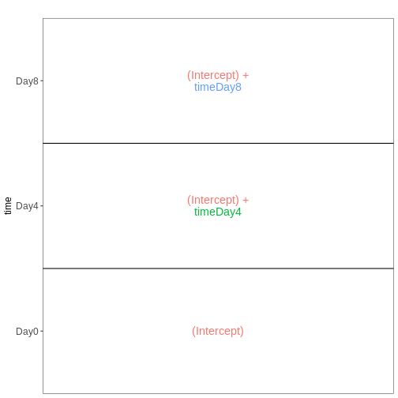
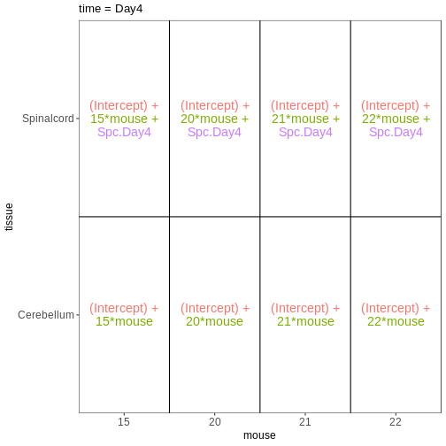

::::::::::::::::::::::::::::::::::::::: objectives

- Explain the formula notation and design matrices.
- Explore different designs and learn how to interpret coefficients.

::::::::::::::::::::::::::::::::::::::::::::::::::

:::::::::::::::::::::::::::::::::::::::: questions

- How do we design experiments optimally?
- How do we interpret a given design?

::::::::::::::::::::::::::::::::::::::::::::::::::


:::::::::::::::::::::::::::::::::::::::::  callout

### Contribute!

This episode is intended to discuss experimental design - what it means,
why it is important, how you would translate your metadata into a suitable
design matrix, how coefficients are to be interpreted.


::::::::::::::::::::::::::::::::::::::::::::::::::


```r
suppressPackageStartupMessages({
    library(SummarizedExperiment)
    library(ExploreModelMatrix)
    library(dplyr)
})
```


```r
meta <- read.csv("data/GSE96870_coldata_all.csv", row.names = 1)
meta
```

```{.output}
                     title geo_accession     organism     age    sex
GSM2545336 CNS_RNA-seq_10C    GSM2545336 Mus musculus 8 weeks Female
GSM2545337 CNS_RNA-seq_11C    GSM2545337 Mus musculus 8 weeks Female
GSM2545338 CNS_RNA-seq_12C    GSM2545338 Mus musculus 8 weeks Female
GSM2545339 CNS_RNA-seq_13C    GSM2545339 Mus musculus 8 weeks Female
GSM2545340 CNS_RNA-seq_14C    GSM2545340 Mus musculus 8 weeks   Male
GSM2545341 CNS_RNA-seq_17C    GSM2545341 Mus musculus 8 weeks   Male
GSM2545342  CNS_RNA-seq_1C    GSM2545342 Mus musculus 8 weeks Female
GSM2545343 CNS_RNA-seq_20C    GSM2545343 Mus musculus 8 weeks   Male
GSM2545344 CNS_RNA-seq_21C    GSM2545344 Mus musculus 8 weeks Female
GSM2545345 CNS_RNA-seq_22C    GSM2545345 Mus musculus 8 weeks   Male
GSM2545346 CNS_RNA-seq_25C    GSM2545346 Mus musculus 8 weeks   Male
GSM2545347 CNS_RNA-seq_26C    GSM2545347 Mus musculus 8 weeks   Male
GSM2545348 CNS_RNA-seq_27C    GSM2545348 Mus musculus 8 weeks Female
GSM2545349 CNS_RNA-seq_28C    GSM2545349 Mus musculus 8 weeks   Male
GSM2545350 CNS_RNA-seq_29C    GSM2545350 Mus musculus 8 weeks   Male
GSM2545351  CNS_RNA-seq_2C    GSM2545351 Mus musculus 8 weeks Female
GSM2545352 CNS_RNA-seq_30C    GSM2545352 Mus musculus 8 weeks Female
GSM2545353  CNS_RNA-seq_3C    GSM2545353 Mus musculus 8 weeks Female
GSM2545354  CNS_RNA-seq_4C    GSM2545354 Mus musculus 8 weeks   Male
GSM2545355 CNS_RNA-seq_571    GSM2545355 Mus musculus 8 weeks   Male
GSM2545356 CNS_RNA-seq_574    GSM2545356 Mus musculus 8 weeks   Male
GSM2545357 CNS_RNA-seq_575    GSM2545357 Mus musculus 8 weeks   Male
GSM2545358 CNS_RNA-seq_583    GSM2545358 Mus musculus 8 weeks Female
GSM2545359 CNS_RNA-seq_585    GSM2545359 Mus musculus 8 weeks Female
GSM2545360 CNS_RNA-seq_589    GSM2545360 Mus musculus 8 weeks   Male
GSM2545361 CNS_RNA-seq_590    GSM2545361 Mus musculus 8 weeks   Male
GSM2545362  CNS_RNA-seq_5C    GSM2545362 Mus musculus 8 weeks Female
GSM2545363  CNS_RNA-seq_6C    GSM2545363 Mus musculus 8 weeks   Male
GSM2545364 CNS_RNA-seq_709    GSM2545364 Mus musculus 8 weeks Female
GSM2545365 CNS_RNA-seq_710    GSM2545365 Mus musculus 8 weeks Female
GSM2545366 CNS_RNA-seq_711    GSM2545366 Mus musculus 8 weeks Female
GSM2545367 CNS_RNA-seq_713    GSM2545367 Mus musculus 8 weeks   Male
GSM2545368 CNS_RNA-seq_728    GSM2545368 Mus musculus 8 weeks   Male
GSM2545369 CNS_RNA-seq_729    GSM2545369 Mus musculus 8 weeks   Male
GSM2545370 CNS_RNA-seq_730    GSM2545370 Mus musculus 8 weeks Female
GSM2545371 CNS_RNA-seq_731    GSM2545371 Mus musculus 8 weeks Female
GSM2545372 CNS_RNA-seq_733    GSM2545372 Mus musculus 8 weeks   Male
GSM2545373 CNS_RNA-seq_735    GSM2545373 Mus musculus 8 weeks   Male
GSM2545374 CNS_RNA-seq_736    GSM2545374 Mus musculus 8 weeks Female
GSM2545375 CNS_RNA-seq_738    GSM2545375 Mus musculus 8 weeks Female
GSM2545376 CNS_RNA-seq_740    GSM2545376 Mus musculus 8 weeks Female
GSM2545377 CNS_RNA-seq_741    GSM2545377 Mus musculus 8 weeks Female
GSM2545378 CNS_RNA-seq_742    GSM2545378 Mus musculus 8 weeks   Male
GSM2545379 CNS_RNA-seq_743    GSM2545379 Mus musculus 8 weeks   Male
GSM2545380  CNS_RNA-seq_9C    GSM2545380 Mus musculus 8 weeks Female
             infection  strain time     tissue mouse
GSM2545336  InfluenzaA C57BL/6 Day8 Cerebellum    14
GSM2545337 NonInfected C57BL/6 Day0 Cerebellum     9
GSM2545338 NonInfected C57BL/6 Day0 Cerebellum    10
GSM2545339  InfluenzaA C57BL/6 Day4 Cerebellum    15
GSM2545340  InfluenzaA C57BL/6 Day4 Cerebellum    18
GSM2545341  InfluenzaA C57BL/6 Day8 Cerebellum     6
GSM2545342  InfluenzaA C57BL/6 Day8 Cerebellum     5
GSM2545343 NonInfected C57BL/6 Day0 Cerebellum    11
GSM2545344  InfluenzaA C57BL/6 Day4 Cerebellum    22
GSM2545345  InfluenzaA C57BL/6 Day4 Cerebellum    13
GSM2545346  InfluenzaA C57BL/6 Day8 Cerebellum    23
GSM2545347  InfluenzaA C57BL/6 Day8 Cerebellum    24
GSM2545348 NonInfected C57BL/6 Day0 Cerebellum     8
GSM2545349 NonInfected C57BL/6 Day0 Cerebellum     7
GSM2545350  InfluenzaA C57BL/6 Day4 Cerebellum     1
GSM2545351  InfluenzaA C57BL/6 Day8 Cerebellum    16
GSM2545352  InfluenzaA C57BL/6 Day4 Cerebellum    21
GSM2545353 NonInfected C57BL/6 Day0 Cerebellum     4
GSM2545354 NonInfected C57BL/6 Day0 Cerebellum     2
GSM2545355  InfluenzaA C57BL/6 Day4 Spinalcord     1
GSM2545356 NonInfected C57BL/6 Day0 Spinalcord     2
GSM2545357 NonInfected C57BL/6 Day0 Spinalcord     3
GSM2545358 NonInfected C57BL/6 Day0 Spinalcord     4
GSM2545359  InfluenzaA C57BL/6 Day8 Spinalcord     5
GSM2545360  InfluenzaA C57BL/6 Day8 Spinalcord     6
GSM2545361 NonInfected C57BL/6 Day0 Spinalcord     7
GSM2545362  InfluenzaA C57BL/6 Day4 Cerebellum    20
GSM2545363  InfluenzaA C57BL/6 Day4 Cerebellum    12
GSM2545364 NonInfected C57BL/6 Day0 Spinalcord     8
GSM2545365 NonInfected C57BL/6 Day0 Spinalcord     9
GSM2545366 NonInfected C57BL/6 Day0 Spinalcord    10
GSM2545367 NonInfected C57BL/6 Day0 Spinalcord    11
GSM2545368  InfluenzaA C57BL/6 Day4 Spinalcord    12
GSM2545369  InfluenzaA C57BL/6 Day4 Spinalcord    13
GSM2545370  InfluenzaA C57BL/6 Day8 Spinalcord    14
GSM2545371  InfluenzaA C57BL/6 Day4 Spinalcord    15
GSM2545372  InfluenzaA C57BL/6 Day8 Spinalcord    17
GSM2545373  InfluenzaA C57BL/6 Day4 Spinalcord    18
GSM2545374  InfluenzaA C57BL/6 Day8 Spinalcord    19
GSM2545375  InfluenzaA C57BL/6 Day4 Spinalcord    20
GSM2545376  InfluenzaA C57BL/6 Day4 Spinalcord    21
GSM2545377  InfluenzaA C57BL/6 Day4 Spinalcord    22
GSM2545378  InfluenzaA C57BL/6 Day8 Spinalcord    23
GSM2545379  InfluenzaA C57BL/6 Day8 Spinalcord    24
GSM2545380  InfluenzaA C57BL/6 Day8 Cerebellum    19
```


```r
vd <- VisualizeDesign(sampleData = meta, 
                      designFormula = ~ tissue + time + sex)
vd$cooccurrenceplots
```

```{.output}
$`tissue = Cerebellum`
```


```{.output}

$`tissue = Spinalcord`
```


## Compare males and females, non-infected spinal cord


```r
meta_noninf_spc <- meta %>% filter(time == "Day0" & 
                                       tissue == "Spinalcord")
meta_noninf_spc
```

```{.output}
                     title geo_accession     organism     age    sex
GSM2545356 CNS_RNA-seq_574    GSM2545356 Mus musculus 8 weeks   Male
GSM2545357 CNS_RNA-seq_575    GSM2545357 Mus musculus 8 weeks   Male
GSM2545358 CNS_RNA-seq_583    GSM2545358 Mus musculus 8 weeks Female
GSM2545361 CNS_RNA-seq_590    GSM2545361 Mus musculus 8 weeks   Male
GSM2545364 CNS_RNA-seq_709    GSM2545364 Mus musculus 8 weeks Female
GSM2545365 CNS_RNA-seq_710    GSM2545365 Mus musculus 8 weeks Female
GSM2545366 CNS_RNA-seq_711    GSM2545366 Mus musculus 8 weeks Female
GSM2545367 CNS_RNA-seq_713    GSM2545367 Mus musculus 8 weeks   Male
             infection  strain time     tissue mouse
GSM2545356 NonInfected C57BL/6 Day0 Spinalcord     2
GSM2545357 NonInfected C57BL/6 Day0 Spinalcord     3
GSM2545358 NonInfected C57BL/6 Day0 Spinalcord     4
GSM2545361 NonInfected C57BL/6 Day0 Spinalcord     7
GSM2545364 NonInfected C57BL/6 Day0 Spinalcord     8
GSM2545365 NonInfected C57BL/6 Day0 Spinalcord     9
GSM2545366 NonInfected C57BL/6 Day0 Spinalcord    10
GSM2545367 NonInfected C57BL/6 Day0 Spinalcord    11
```

```r
vd <- VisualizeDesign(sampleData = meta_noninf_spc, 
                      designFormula = ~ sex)
vd$designmatrix
```

```{.output}
           (Intercept) sexMale
GSM2545356           1       1
GSM2545357           1       1
GSM2545358           1       0
GSM2545361           1       1
GSM2545364           1       0
GSM2545365           1       0
GSM2545366           1       0
GSM2545367           1       1
```

```r
vd$plotlist
```

```{.output}
[[1]]
```


:::::::::::::::::::::::::::::::::::::::  challenge

### Challenge: Can you do it?

Set up the design formula to compare the three time points (Day0, Day4, Day8) in the male spinal cord samples, and visualize it using `ExploreModelMatrix`.

:::::::::::::::  solution

### Solution


```r
meta_male_spc <- meta %>% filter(sex == "Male" & tissue == "Spinalcord")
meta_male_spc
```

```{.output}
                     title geo_accession     organism     age  sex   infection
GSM2545355 CNS_RNA-seq_571    GSM2545355 Mus musculus 8 weeks Male  InfluenzaA
GSM2545356 CNS_RNA-seq_574    GSM2545356 Mus musculus 8 weeks Male NonInfected
GSM2545357 CNS_RNA-seq_575    GSM2545357 Mus musculus 8 weeks Male NonInfected
GSM2545360 CNS_RNA-seq_589    GSM2545360 Mus musculus 8 weeks Male  InfluenzaA
GSM2545361 CNS_RNA-seq_590    GSM2545361 Mus musculus 8 weeks Male NonInfected
GSM2545367 CNS_RNA-seq_713    GSM2545367 Mus musculus 8 weeks Male NonInfected
GSM2545368 CNS_RNA-seq_728    GSM2545368 Mus musculus 8 weeks Male  InfluenzaA
GSM2545369 CNS_RNA-seq_729    GSM2545369 Mus musculus 8 weeks Male  InfluenzaA
GSM2545372 CNS_RNA-seq_733    GSM2545372 Mus musculus 8 weeks Male  InfluenzaA
GSM2545373 CNS_RNA-seq_735    GSM2545373 Mus musculus 8 weeks Male  InfluenzaA
GSM2545378 CNS_RNA-seq_742    GSM2545378 Mus musculus 8 weeks Male  InfluenzaA
GSM2545379 CNS_RNA-seq_743    GSM2545379 Mus musculus 8 weeks Male  InfluenzaA
            strain time     tissue mouse
GSM2545355 C57BL/6 Day4 Spinalcord     1
GSM2545356 C57BL/6 Day0 Spinalcord     2
GSM2545357 C57BL/6 Day0 Spinalcord     3
GSM2545360 C57BL/6 Day8 Spinalcord     6
GSM2545361 C57BL/6 Day0 Spinalcord     7
GSM2545367 C57BL/6 Day0 Spinalcord    11
GSM2545368 C57BL/6 Day4 Spinalcord    12
GSM2545369 C57BL/6 Day4 Spinalcord    13
GSM2545372 C57BL/6 Day8 Spinalcord    17
GSM2545373 C57BL/6 Day4 Spinalcord    18
GSM2545378 C57BL/6 Day8 Spinalcord    23
GSM2545379 C57BL/6 Day8 Spinalcord    24
```

```r
vd <- VisualizeDesign(sampleData = meta_male_spc, designFormula = ~ time)
vd$designmatrix
```

```{.output}
           (Intercept) timeDay4 timeDay8
GSM2545355           1        1        0
GSM2545356           1        0        0
GSM2545357           1        0        0
GSM2545360           1        0        1
GSM2545361           1        0        0
GSM2545367           1        0        0
GSM2545368           1        1        0
GSM2545369           1        1        0
GSM2545372           1        0        1
GSM2545373           1        1        0
GSM2545378           1        0        1
GSM2545379           1        0        1
```

```r
vd$plotlist
```

```{.output}
[[1]]
```



:::::::::::::::::::::::::

::::::::::::::::::::::::::::::::::::::::::::::::::

## Factorial design without interactions


```r
meta_noninf <- meta %>% filter(time == "Day0")
meta_noninf
```

```{.output}
                     title geo_accession     organism     age    sex
GSM2545337 CNS_RNA-seq_11C    GSM2545337 Mus musculus 8 weeks Female
GSM2545338 CNS_RNA-seq_12C    GSM2545338 Mus musculus 8 weeks Female
GSM2545343 CNS_RNA-seq_20C    GSM2545343 Mus musculus 8 weeks   Male
GSM2545348 CNS_RNA-seq_27C    GSM2545348 Mus musculus 8 weeks Female
GSM2545349 CNS_RNA-seq_28C    GSM2545349 Mus musculus 8 weeks   Male
GSM2545353  CNS_RNA-seq_3C    GSM2545353 Mus musculus 8 weeks Female
GSM2545354  CNS_RNA-seq_4C    GSM2545354 Mus musculus 8 weeks   Male
GSM2545356 CNS_RNA-seq_574    GSM2545356 Mus musculus 8 weeks   Male
GSM2545357 CNS_RNA-seq_575    GSM2545357 Mus musculus 8 weeks   Male
GSM2545358 CNS_RNA-seq_583    GSM2545358 Mus musculus 8 weeks Female
GSM2545361 CNS_RNA-seq_590    GSM2545361 Mus musculus 8 weeks   Male
GSM2545364 CNS_RNA-seq_709    GSM2545364 Mus musculus 8 weeks Female
GSM2545365 CNS_RNA-seq_710    GSM2545365 Mus musculus 8 weeks Female
GSM2545366 CNS_RNA-seq_711    GSM2545366 Mus musculus 8 weeks Female
GSM2545367 CNS_RNA-seq_713    GSM2545367 Mus musculus 8 weeks   Male
             infection  strain time     tissue mouse
GSM2545337 NonInfected C57BL/6 Day0 Cerebellum     9
GSM2545338 NonInfected C57BL/6 Day0 Cerebellum    10
GSM2545343 NonInfected C57BL/6 Day0 Cerebellum    11
GSM2545348 NonInfected C57BL/6 Day0 Cerebellum     8
GSM2545349 NonInfected C57BL/6 Day0 Cerebellum     7
GSM2545353 NonInfected C57BL/6 Day0 Cerebellum     4
GSM2545354 NonInfected C57BL/6 Day0 Cerebellum     2
GSM2545356 NonInfected C57BL/6 Day0 Spinalcord     2
GSM2545357 NonInfected C57BL/6 Day0 Spinalcord     3
GSM2545358 NonInfected C57BL/6 Day0 Spinalcord     4
GSM2545361 NonInfected C57BL/6 Day0 Spinalcord     7
GSM2545364 NonInfected C57BL/6 Day0 Spinalcord     8
GSM2545365 NonInfected C57BL/6 Day0 Spinalcord     9
GSM2545366 NonInfected C57BL/6 Day0 Spinalcord    10
GSM2545367 NonInfected C57BL/6 Day0 Spinalcord    11
```

```r
vd <- VisualizeDesign(sampleData = meta_noninf, 
                      designFormula = ~ sex + tissue)
vd$designmatrix
```

```{.output}
           (Intercept) sexMale tissueSpinalcord
GSM2545337           1       0                0
GSM2545338           1       0                0
GSM2545343           1       1                0
GSM2545348           1       0                0
GSM2545349           1       1                0
GSM2545353           1       0                0
GSM2545354           1       1                0
GSM2545356           1       1                1
GSM2545357           1       1                1
GSM2545358           1       0                1
GSM2545361           1       1                1
GSM2545364           1       0                1
GSM2545365           1       0                1
GSM2545366           1       0                1
GSM2545367           1       1                1
```

```r
vd$plotlist
```

```{.output}
[[1]]
```


## Factorial design with interactions


```r
meta_noninf <- meta %>% filter(time == "Day0")
meta_noninf
```

```{.output}
                     title geo_accession     organism     age    sex
GSM2545337 CNS_RNA-seq_11C    GSM2545337 Mus musculus 8 weeks Female
GSM2545338 CNS_RNA-seq_12C    GSM2545338 Mus musculus 8 weeks Female
GSM2545343 CNS_RNA-seq_20C    GSM2545343 Mus musculus 8 weeks   Male
GSM2545348 CNS_RNA-seq_27C    GSM2545348 Mus musculus 8 weeks Female
GSM2545349 CNS_RNA-seq_28C    GSM2545349 Mus musculus 8 weeks   Male
GSM2545353  CNS_RNA-seq_3C    GSM2545353 Mus musculus 8 weeks Female
GSM2545354  CNS_RNA-seq_4C    GSM2545354 Mus musculus 8 weeks   Male
GSM2545356 CNS_RNA-seq_574    GSM2545356 Mus musculus 8 weeks   Male
GSM2545357 CNS_RNA-seq_575    GSM2545357 Mus musculus 8 weeks   Male
GSM2545358 CNS_RNA-seq_583    GSM2545358 Mus musculus 8 weeks Female
GSM2545361 CNS_RNA-seq_590    GSM2545361 Mus musculus 8 weeks   Male
GSM2545364 CNS_RNA-seq_709    GSM2545364 Mus musculus 8 weeks Female
GSM2545365 CNS_RNA-seq_710    GSM2545365 Mus musculus 8 weeks Female
GSM2545366 CNS_RNA-seq_711    GSM2545366 Mus musculus 8 weeks Female
GSM2545367 CNS_RNA-seq_713    GSM2545367 Mus musculus 8 weeks   Male
             infection  strain time     tissue mouse
GSM2545337 NonInfected C57BL/6 Day0 Cerebellum     9
GSM2545338 NonInfected C57BL/6 Day0 Cerebellum    10
GSM2545343 NonInfected C57BL/6 Day0 Cerebellum    11
GSM2545348 NonInfected C57BL/6 Day0 Cerebellum     8
GSM2545349 NonInfected C57BL/6 Day0 Cerebellum     7
GSM2545353 NonInfected C57BL/6 Day0 Cerebellum     4
GSM2545354 NonInfected C57BL/6 Day0 Cerebellum     2
GSM2545356 NonInfected C57BL/6 Day0 Spinalcord     2
GSM2545357 NonInfected C57BL/6 Day0 Spinalcord     3
GSM2545358 NonInfected C57BL/6 Day0 Spinalcord     4
GSM2545361 NonInfected C57BL/6 Day0 Spinalcord     7
GSM2545364 NonInfected C57BL/6 Day0 Spinalcord     8
GSM2545365 NonInfected C57BL/6 Day0 Spinalcord     9
GSM2545366 NonInfected C57BL/6 Day0 Spinalcord    10
GSM2545367 NonInfected C57BL/6 Day0 Spinalcord    11
```

```r
vd <- VisualizeDesign(sampleData = meta_noninf, 
                      designFormula = ~ sex * tissue)
vd$designmatrix
```

```{.output}
           (Intercept) sexMale tissueSpinalcord sexMale:tissueSpinalcord
GSM2545337           1       0                0                        0
GSM2545338           1       0                0                        0
GSM2545343           1       1                0                        0
GSM2545348           1       0                0                        0
GSM2545349           1       1                0                        0
GSM2545353           1       0                0                        0
GSM2545354           1       1                0                        0
GSM2545356           1       1                1                        1
GSM2545357           1       1                1                        1
GSM2545358           1       0                1                        0
GSM2545361           1       1                1                        1
GSM2545364           1       0                1                        0
GSM2545365           1       0                1                        0
GSM2545366           1       0                1                        0
GSM2545367           1       1                1                        1
```

```r
vd$plotlist
```

```{.output}
[[1]]
```


## Paired design


```r
meta_fem_day0 <- meta %>% filter(sex == "Female" & 
                                     time == "Day0")
meta_fem_day0
```

```{.output}
                     title geo_accession     organism     age    sex
GSM2545337 CNS_RNA-seq_11C    GSM2545337 Mus musculus 8 weeks Female
GSM2545338 CNS_RNA-seq_12C    GSM2545338 Mus musculus 8 weeks Female
GSM2545348 CNS_RNA-seq_27C    GSM2545348 Mus musculus 8 weeks Female
GSM2545353  CNS_RNA-seq_3C    GSM2545353 Mus musculus 8 weeks Female
GSM2545358 CNS_RNA-seq_583    GSM2545358 Mus musculus 8 weeks Female
GSM2545364 CNS_RNA-seq_709    GSM2545364 Mus musculus 8 weeks Female
GSM2545365 CNS_RNA-seq_710    GSM2545365 Mus musculus 8 weeks Female
GSM2545366 CNS_RNA-seq_711    GSM2545366 Mus musculus 8 weeks Female
             infection  strain time     tissue mouse
GSM2545337 NonInfected C57BL/6 Day0 Cerebellum     9
GSM2545338 NonInfected C57BL/6 Day0 Cerebellum    10
GSM2545348 NonInfected C57BL/6 Day0 Cerebellum     8
GSM2545353 NonInfected C57BL/6 Day0 Cerebellum     4
GSM2545358 NonInfected C57BL/6 Day0 Spinalcord     4
GSM2545364 NonInfected C57BL/6 Day0 Spinalcord     8
GSM2545365 NonInfected C57BL/6 Day0 Spinalcord     9
GSM2545366 NonInfected C57BL/6 Day0 Spinalcord    10
```

```r
vd <- VisualizeDesign(sampleData = meta_fem_day0,
                      designFormula = ~ mouse + tissue)
vd$designmatrix
```

```{.output}
           (Intercept) mouse tissueSpinalcord
GSM2545337           1     9                0
GSM2545338           1    10                0
GSM2545348           1     8                0
GSM2545353           1     4                0
GSM2545358           1     4                1
GSM2545364           1     8                1
GSM2545365           1     9                1
GSM2545366           1    10                1
```

```r
vd$plotlist
```

```{.output}
[[1]]
```


## Within- and between-subject comparisons


```r
meta_fem_day04 <- meta %>% 
    filter(sex == "Female" & 
               time %in% c("Day0", "Day4")) %>%
    droplevels()
meta_fem_day04
```

```{.output}
                     title geo_accession     organism     age    sex
GSM2545337 CNS_RNA-seq_11C    GSM2545337 Mus musculus 8 weeks Female
GSM2545338 CNS_RNA-seq_12C    GSM2545338 Mus musculus 8 weeks Female
GSM2545339 CNS_RNA-seq_13C    GSM2545339 Mus musculus 8 weeks Female
GSM2545344 CNS_RNA-seq_21C    GSM2545344 Mus musculus 8 weeks Female
GSM2545348 CNS_RNA-seq_27C    GSM2545348 Mus musculus 8 weeks Female
GSM2545352 CNS_RNA-seq_30C    GSM2545352 Mus musculus 8 weeks Female
GSM2545353  CNS_RNA-seq_3C    GSM2545353 Mus musculus 8 weeks Female
GSM2545358 CNS_RNA-seq_583    GSM2545358 Mus musculus 8 weeks Female
GSM2545362  CNS_RNA-seq_5C    GSM2545362 Mus musculus 8 weeks Female
GSM2545364 CNS_RNA-seq_709    GSM2545364 Mus musculus 8 weeks Female
GSM2545365 CNS_RNA-seq_710    GSM2545365 Mus musculus 8 weeks Female
GSM2545366 CNS_RNA-seq_711    GSM2545366 Mus musculus 8 weeks Female
GSM2545371 CNS_RNA-seq_731    GSM2545371 Mus musculus 8 weeks Female
GSM2545375 CNS_RNA-seq_738    GSM2545375 Mus musculus 8 weeks Female
GSM2545376 CNS_RNA-seq_740    GSM2545376 Mus musculus 8 weeks Female
GSM2545377 CNS_RNA-seq_741    GSM2545377 Mus musculus 8 weeks Female
             infection  strain time     tissue mouse
GSM2545337 NonInfected C57BL/6 Day0 Cerebellum     9
GSM2545338 NonInfected C57BL/6 Day0 Cerebellum    10
GSM2545339  InfluenzaA C57BL/6 Day4 Cerebellum    15
GSM2545344  InfluenzaA C57BL/6 Day4 Cerebellum    22
GSM2545348 NonInfected C57BL/6 Day0 Cerebellum     8
GSM2545352  InfluenzaA C57BL/6 Day4 Cerebellum    21
GSM2545353 NonInfected C57BL/6 Day0 Cerebellum     4
GSM2545358 NonInfected C57BL/6 Day0 Spinalcord     4
GSM2545362  InfluenzaA C57BL/6 Day4 Cerebellum    20
GSM2545364 NonInfected C57BL/6 Day0 Spinalcord     8
GSM2545365 NonInfected C57BL/6 Day0 Spinalcord     9
GSM2545366 NonInfected C57BL/6 Day0 Spinalcord    10
GSM2545371  InfluenzaA C57BL/6 Day4 Spinalcord    15
GSM2545375  InfluenzaA C57BL/6 Day4 Spinalcord    20
GSM2545376  InfluenzaA C57BL/6 Day4 Spinalcord    21
GSM2545377  InfluenzaA C57BL/6 Day4 Spinalcord    22
```

```r
design <- model.matrix(~ mouse, data = meta_fem_day04)
design <- cbind(design, 
                Spc.Day0 = meta_fem_day04$tissue == "Spinalcord" & 
                    meta_fem_day04$time == "Day0",
                Spc.Day4 = meta_fem_day04$tissue == "Spinalcord" & 
                    meta_fem_day04$time == "Day4")
rownames(design) <- rownames(meta_fem_day04)
design
```

```{.output}
           (Intercept) mouse Spc.Day0 Spc.Day4
GSM2545337           1     9        0        0
GSM2545338           1    10        0        0
GSM2545339           1    15        0        0
GSM2545344           1    22        0        0
GSM2545348           1     8        0        0
GSM2545352           1    21        0        0
GSM2545353           1     4        0        0
GSM2545358           1     4        1        0
GSM2545362           1    20        0        0
GSM2545364           1     8        1        0
GSM2545365           1     9        1        0
GSM2545366           1    10        1        0
GSM2545371           1    15        0        1
GSM2545375           1    20        0        1
GSM2545376           1    21        0        1
GSM2545377           1    22        0        1
```

```r
vd <- VisualizeDesign(sampleData = meta_fem_day04 %>%
                          select(time, tissue, mouse),
                      designFormula = NULL, 
                      designMatrix = design, flipCoordFitted = FALSE)
vd$designmatrix
```

```{.output}
           (Intercept) mouse Spc.Day0 Spc.Day4
GSM2545337           1     9        0        0
GSM2545338           1    10        0        0
GSM2545339           1    15        0        0
GSM2545344           1    22        0        0
GSM2545348           1     8        0        0
GSM2545352           1    21        0        0
GSM2545353           1     4        0        0
GSM2545358           1     4        1        0
GSM2545362           1    20        0        0
GSM2545364           1     8        1        0
GSM2545365           1     9        1        0
GSM2545366           1    10        1        0
GSM2545371           1    15        0        1
GSM2545375           1    20        0        1
GSM2545376           1    21        0        1
GSM2545377           1    22        0        1
```

```r
vd$plotlist
```

```{.output}
$`time = Day0`
```


```{.output}

$`time = Day4`
```



:::::::::::::::::::::::::::::::::::::::: keypoints

- Key point 1

::::::::::::::::::::::::::::::::::::::::::::::::::


