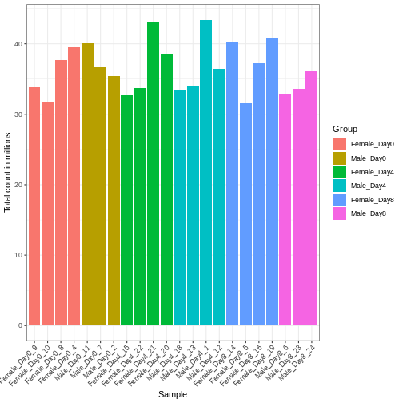
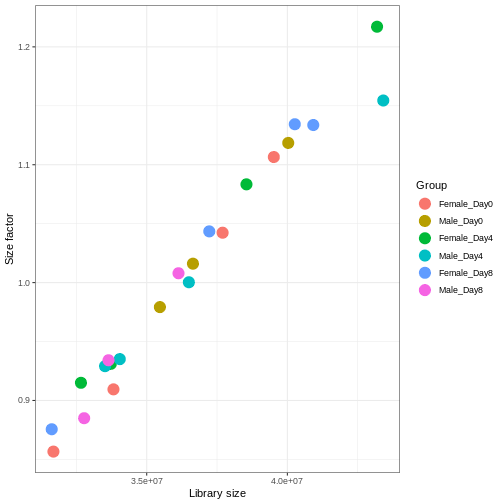
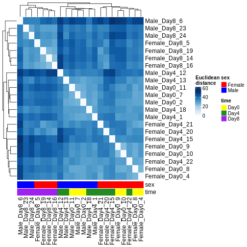

::::::::::::::::::::::::::::::::::::::: objectives

- Learn how to explore the gene expression matrix and perform common quality control steps.
- Learn how to set up an interactive application for exploratory analysis.

::::::::::::::::::::::::::::::::::::::::::::::::::

:::::::::::::::::::::::::::::::::::::::: questions

- Why is exploratory analysis an essential part of an RNA-seq analysis? 
- How should one preprocess the raw count matrix for exploratory analysis?  
- Are two dimensions sufficient to represent your data?

::::::::::::::::::::::::::::::::::::::::::::::::::

:::::::::::::::::::::::::::::::::::::::::  callout

### Contribute!

This episode is intended to introduce various types of exploratory analysis
and QC steps taken before a formal statistical analysis is done.


::::::::::::::::::::::::::::::::::::::::::::::::::


## Load libraries

Assuming you just started RStudio again, load some packages we will use in this lesson along with the `SummarizedExperiment` object we created in the last lesson.


```r
suppressPackageStartupMessages({
    library(SummarizedExperiment)
    library(DESeq2)
    library(vsn)
    library(ggplot2)
    library(ComplexHeatmap)
    library(RColorBrewer)
    library(hexbin)
})
```


```r
se <- readRDS("data/GSE96870_se.rds")
```


## Remove unexpressed genes

Exploratory analysis is crucial for quality control and to get to know our data.
It can help us detect quality problems, sample swaps and contamination, as well as give us a sense of the most salient patterns present in the data.
In this episode, we will learn about two common ways of performing exploratory analysis for RNA-seq data; namely clustering and principal component analysis (PCA).
These tools are in no way limited to (or developed for) analysis of RNA-seq data.
However, there are certain characteristics of count assays that need to be taken into account when they are applied to this type of data. First of all, not all mouse genes in the genome will be expressed in our Cerebellum samples. There are many different threshold you could use to say whether a gene's expression was detectable or not; here we are going to use a very minimal one that if a gene does not have more than 5 counts total across all samples, there is simply not enough data to be able to do anything with it anyway. 


```r
nrow(se)
```

```{.output}
[1] 41786
```

```r
# Remove genes/rows that do not have > 5 total counts 
se <- se[rowSums(assay(se, "counts")) > 5, ]
nrow(se)
```

```{.output}
[1] 27430
```


:::::::::::::::::::::::::::::::::::::::  challenge

## Challenge: What kind of genes survived this filtering?

Last episode we discussed subsetting down to only mRNA genes. Here we subsetted based on a minimal expression level. How many of each type of gene survived the filtering?
  
::::::::::::::::::::::::::::::::::::::::::::::::::

::::::::::::::::::::::::::::::::::: solution


```r
table(rowData(se)$gbkey)
```

```{.output}

     C_region          exon     J_segment      misc_RNA          mRNA 
           14          1765            14          1539         16859 
        ncRNA precursor_RNA          rRNA          tRNA     V_segment 
         6789           362             2            64            22 
```

:::::::::::::::::::::::::::::::::::


## Library size differences

Differences in the total number of reads assigned to genes between samples typically occur for technical reasons. In practice, it means that we can not simply compare a gene's raw read count directly between samples and conclude that a sample with a higher read count also expresses the gene more strongly - the higher count may be caused by an overall higher number of reads in that sample.
In the rest of this section, we will use the term *library size* to refer to the total number of reads assigned to genes for a sample. First we should compare the library sizes of all samples. 


```r
# Add in the sum of all counts

se$libSize <-  colSums(assay(se))

# Plot the libSize by using R's native pipe |>
# to extract the colData, turn it into a regular
# data frame then send to ggplot:

colData(se) |>
  as.data.frame() |>
  ggplot(aes(x = Label, y = libSize / 1e6, fill = Group)) + 
         geom_bar(stat = "identity") + theme_bw() + 
         labs(x = "Sample", y = "Total count in millions") + 
         theme(axis.text.x = element_text(angle = 45, hjust = 1, vjust = 1))
```




We need to adjust for the differences in library size between samples, to avoid drawing incorrect conclusions. The way this is typically done for RNA-seq data can be described as a two-step procedure.
First, we estimate *size factors* - sample-specific correction factors such that if the raw counts were to be divided by these factors, the resulting values would be more comparable across samples.
Next, these size factors are incorporated into the statistical analysis of the data.
It is important to pay close attention to how this is done in practice for a given analysis method.
Sometimes the division of the counts by the size factors needs to be done explicitly by the analyst.
Other times (as we will see for the differential expression analysis) it is important that they are provided separately to the analysis tool, which will then use them appropriately in the statistical model.

With `DESeq2`, size factors are calculated using the `estimateSizeFactors()` function.
The size factors estimated by this function combines an adjustment for differences in library sizes with an adjustment for differences in the RNA composition of the samples.
The latter is important due to the compositional nature of RNA-seq data.
There is a fixed number of reads to distribute between the genes, and if a single (or a few) very highly expressed gene consume a large part of the reads, all other genes will consequently receive very low counts. We now switch our `SummarizedExperiment` object over to a `DESeqDataSet` as it has the internal structure to store these size factors. We also need to tell it our main experiment design, which is sex and time: 


```r
dds <- DESeq2::DESeqDataSet(se, design = ~ sex + time)
```

```{.warning}
Warning in DESeq2::DESeqDataSet(se, design = ~sex + time): some variables in
design formula are characters, converting to factors
```

```r
dds <- estimateSizeFactors(dds)

# Plot the size factors against library size
# and look for any patterns by group:

ggplot(data.frame(libSize = colSums(assay(dds)),
                  sizeFactor = sizeFactors(dds),
                  Group = dds$Group),
       aes(x = libSize, y = sizeFactor, col = Group)) + 
    geom_point(size = 5) + theme_bw() + 
    labs(x = "Library size", y = "Size factor")
```



## Transform data

There is a rich literature on methods for exploratory analysis.
Most of these work best in situations where the variance of the input data (here, each gene) is relatively independent of the average value.
For read count data such as RNA-seq, this is not the case.
In fact, the variance increases with the average read count.


```r
meanSdPlot(assay(dds), ranks = FALSE)
```


There are two ways around this: either we develop methods specifically adapted to count data, or we adapt (transform) the count data so that the existing methods are applicable.
Both ways have been explored; however, at the moment the second approach is arguably more widely applied in practice. We can transform our data using DESeq2's variance stablizing transformation and then verify that is had removed the correlation between average read count and variance.


```r
vsd <- DESeq2::vst(dds, blind = TRUE)
meanSdPlot(assay(vsd), ranks = FALSE)
```



## Heatmaps and clustering

There are many ways to cluster samples based on their similarity of expression patterns. One simple way is to calculate Euclidean distances between all pairs of samples (longer distance = more different) and then display the results with both a branching dendrogram and a heatmap to visualize the distances in color. From this, we infer that the Day 8 samples are more similar to each other than the rest of the samples, although Day 4 and Day 0 do not separate distinctly. Instead, males and females reliably separate.


```r
dst <- dist(t(assay(vsd)))
colors <- colorRampPalette(brewer.pal(9, "Blues"))(255)
ComplexHeatmap::Heatmap(
    as.matrix(dst), 
    col = colors,
    name = "Euclidean\ndistance",
    cluster_rows = hclust(dst),
    cluster_columns = hclust(dst),
    bottom_annotation = columnAnnotation(
        sex = vsd$sex,
        time = vsd$time,
        col = list(sex = c(Female = "red", Male = "blue"),
                   time = c(Day0 = "yellow", Day4 = "forestgreen", Day8 = "purple")))
)
```


## PCA

Principal component analysis is a dimensionality reduction method, which projects the samples into a lower-dimensional space.
This lower-dimensional representation can be used for visualization, or as the input for other analysis methods.
The principal components are defined in such a way that they are orthogonal, and that the projection of the samples into the space they span contains as much variance as possible.
It is an *unsupervised* method in the sense that no external information about the samples (e.g., the treatment condition) is taken into account.
In the plot below we represent the samples in a two-dimensional principal component space.
For each of the two dimensions, we indicate the fraction of the total variance that is represented by that component.
By definition, the first principal component will always represent more of the variance than the subsequent ones.
The fraction of explained variance is a measure of how much of the 'signal' in the data that is retained when we project the samples from the original, high-dimensional space to the low-dimensional space for visualization.


```r
pcaData <- DESeq2::plotPCA(vsd, intgroup = c("sex", "time"),
                           returnData = TRUE)
percentVar <- round(100 * attr(pcaData, "percentVar"))
ggplot(pcaData, aes(x = PC1, y = PC2)) +
    geom_point(aes(color = sex, shape = time), size = 5) +
    theme_minimal() +
    xlab(paste0("PC1: ", percentVar[1], "% variance")) +
    ylab(paste0("PC2: ", percentVar[2], "% variance")) +
    coord_fixed() + 
    scale_color_manual(values = c(Male = "blue", Female = "red"))
```


## Session info


```r
sessionInfo()
```

```{.output}
R version 4.3.1 (2023-06-16)
Platform: x86_64-pc-linux-gnu (64-bit)
Running under: Ubuntu 22.04.3 LTS

Matrix products: default
BLAS:   /usr/lib/x86_64-linux-gnu/blas/libblas.so.3.10.0 
LAPACK: /usr/lib/x86_64-linux-gnu/lapack/liblapack.so.3.10.0

locale:
 [1] LC_CTYPE=C.UTF-8       LC_NUMERIC=C           LC_TIME=C.UTF-8       
 [4] LC_COLLATE=C.UTF-8     LC_MONETARY=C.UTF-8    LC_MESSAGES=C.UTF-8   
 [7] LC_PAPER=C.UTF-8       LC_NAME=C              LC_ADDRESS=C          
[10] LC_TELEPHONE=C         LC_MEASUREMENT=C.UTF-8 LC_IDENTIFICATION=C   

time zone: UTC
tzcode source: system (glibc)

attached base packages:
[1] grid      stats4    stats     graphics  grDevices utils     datasets 
[8] methods   base     

other attached packages:
 [1] hexbin_1.28.3               RColorBrewer_1.1-3         
 [3] ComplexHeatmap_2.16.0       ggplot2_3.4.2              
 [5] vsn_3.68.0                  DESeq2_1.40.2              
 [7] SummarizedExperiment_1.30.2 Biobase_2.60.0             
 [9] MatrixGenerics_1.12.2       matrixStats_1.0.0          
[11] GenomicRanges_1.52.0        GenomeInfoDb_1.36.1        
[13] IRanges_2.34.1              S4Vectors_0.38.1           
[15] BiocGenerics_0.46.0        

loaded via a namespace (and not attached):
 [1] shape_1.4.6             circlize_0.4.15         gtable_0.3.3           
 [4] rjson_0.2.21            xfun_0.39               GlobalOptions_0.1.2    
 [7] lattice_0.21-8          vctrs_0.6.3             tools_4.3.1            
[10] bitops_1.0-7            generics_0.1.3          parallel_4.3.1         
[13] tibble_3.2.1            fansi_1.0.4             highr_0.10             
[16] cluster_2.1.4           pkgconfig_2.0.3         Matrix_1.5-4.1         
[19] lifecycle_1.0.3         GenomeInfoDbData_1.2.10 farver_2.1.1           
[22] compiler_4.3.1          munsell_0.5.0           codetools_0.2-19       
[25] clue_0.3-64             RCurl_1.98-1.12         yaml_2.3.7             
[28] preprocessCore_1.62.1   pillar_1.9.0            crayon_1.5.2           
[31] BiocParallel_1.34.2     affy_1.78.0             DelayedArray_0.26.6    
[34] limma_3.56.2            iterators_1.0.14        foreach_1.5.2          
[37] tidyselect_1.2.0        locfit_1.5-9.8          digest_0.6.33          
[40] dplyr_1.1.2             labeling_0.4.2          colorspace_2.1-0       
[43] cli_3.6.1               magrittr_2.0.3          S4Arrays_1.0.4         
[46] utf8_1.2.3              withr_2.5.0             scales_1.2.1           
[49] XVector_0.40.0          affyio_1.70.0           GetoptLong_1.0.5       
[52] png_0.1-8               evaluate_0.21           knitr_1.43             
[55] doParallel_1.0.17       rlang_1.1.1             Rcpp_1.0.11            
[58] glue_1.6.2              BiocManager_1.30.21     renv_1.0.2             
[61] R6_2.5.1                zlibbioc_1.46.0        
```

:::::::::::::::::::::::::::::::::::::::: keypoints

- Exploratory analysis is essential for quality control and to detect potential problems with a data set. 
- Different classes of exploratory analysis methods expect differently preprocessed data. The most commonly used methods expect counts to be normalized and log-transformed (or similar- more sensitive/sophisticated), to be closer to homoskedastic. Other methods work directly on the raw counts.  


::::::::::::::::::::::::::::::::::::::::::::::::::


