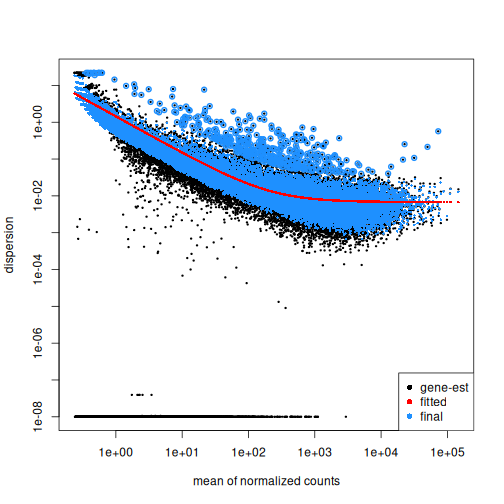
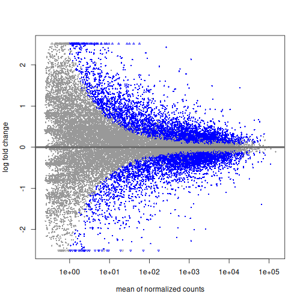
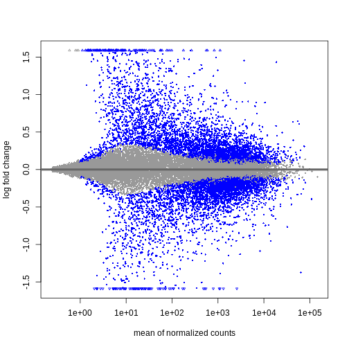
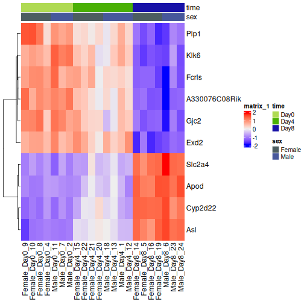

::::::::::::::::::::::::::::::::::::::: objectives

- Explain the steps involved in a differential expression analysis.
- Explain how to perform these steps in R, using DESeq2.

::::::::::::::::::::::::::::::::::::::::::::::::::

:::::::::::::::::::::::::::::::::::::::: questions

- What are the steps performed in a typical differential expression analysis? 
- How does one interpret the output of DESeq2?


::::::::::::::::::::::::::::::::::::::::::::::::::


## Differential expression inference

A major goal of RNA-seq data analysis is the quantification and statistical inference of systematic changes between experimental groups or conditions (e.g., treatment vs. control, timepoints, tissues). This is typically performed by identifying genes with differential expression pattern using between- and within-condition variability and thus requires biological replicates (multiple sample of the same condition).
Multiple software packages exist to perform differential expression analysis. Comparative studies have shown some concordance of differentially expressed (DE) genes, but also variability between tools with no tool consistently outperforming all others (see [Soneson and Delorenzi, 2013](https://bmcbioinformatics.biomedcentral.com/articles/10.1186/1471-2105-14-91)). 
In the following we will explain and conduct differential expression analysis using the [DESeq2](https://bioconductor.org/packages/release/bioc/html/DESeq2.html) 
software package. The [edgeR](https://bioconductor.org/packages/release/bioc/html/edgeR.html) package implements similar methods following the same main assumptions about count data. Both packages show a general good and stable performance with comparable results.  

## The DESeqDataSet

To run `DESeq2` we need to represent our count data as object of the `DESeqDataSet` class.
The `DESeqDataSet` is an extension of the `SummarizedExperiment` class (see section [Importing and annotating quantified data into R](../episodes/03-import-annotate.Rmd) ) that stores a *design formula* in addition to the count assay(s) and feature (here gene) and sample metadata.
The *design formula* expresses the variables which will be used in modeling. These are typically the variable of interest (group variable) and other variables you want to account for (e.g., batch effect variables). A detailed explanation of *design formulas* and related *design matrices* will follow in the section about [extra exploration of design matrices](../episodes/06-extra-design.Rmd). Objects of the `DESeqDataSet` class can be build from [count matrices](https://bioconductor.org/packages/release/bioc/vignettes/DESeq2/inst/doc/DESeq2.html#countmat), [SummarizedExperiment objects](https://bioconductor.org/packages/release/bioc/vignettes/DESeq2/inst/doc/DESeq2.html#se), [transcript abundance files](https://bioconductor.org/packages/release/bioc/vignettes/DESeq2/inst/doc/DESeq2.html#tximport) or [htseq count files](https://bioconductor.org/packages/release/bioc/vignettes/DESeq2/inst/doc/DESeq2.html#htseq).

### Load packages


``` r
suppressPackageStartupMessages({
    library(SummarizedExperiment)
    library(DESeq2)
    library(ggplot2)
    library(ExploreModelMatrix)
    library(cowplot)
    library(ComplexHeatmap)
    library(apeglm)
})
```

### Load data

Let's load in our `SummarizedExperiment` object again. In the last episode for quality control exploration, we removed ~35% genes that had 5 or fewer counts because they had too little information in them. For DESeq2 statistical analysis, we do not technically have to remove these genes because by default it will do some independent filtering, but it can reduce the memory size of the `DESeqDataSet` object resulting in faster computation. Plus, we do not want these genes cluttering up some of the visualizations. 


``` r
se <- readRDS("data/GSE96870_se.rds")
se <- se[rowSums(assay(se, "counts")) > 5, ]
```

### Create DESeqDataSet

The design matrix we will use in this example is `~ sex + time`. This will allow us test the difference between males and females (averaged over time point) and the difference between day 0, 4 and 8 (averaged over males and females). If we wanted to test other comparisons (e.g., Female.Day8 vs. Female.Day0 and also Male.Day8 vs. Male.Day0) we could use a different design matrix to more easily extract those pairwise comparisons. 


``` r
dds <- DESeq2::DESeqDataSet(se,
                            design = ~ sex + time)
```

``` warning
Warning in DESeq2::DESeqDataSet(se, design = ~sex + time): some variables in
design formula are characters, converting to factors
```


::::::::::::::::::::::::::::::::::::: instructor
The function to generate a `DESeqDataSet` needs to be adapted depending on the input type, e.g, 


``` r
#From SummarizedExperiment object
ddsSE <- DESeqDataSet(se, design = ~ sex + time)

#From count matrix
dds <- DESeqDataSetFromMatrix(countData = assays(se)$counts,
                              colData = colData(se),
                              design = ~ sex + time)
```

:::::::::::::::::::::::::::::::::::::::::::::::::


## Normalization

 `DESeq2` and `edgeR` make the following assumptions:

- most genes are not differentially expressed
- the probability of a read mapping to a specific gene is the same for all samples within the same group

As shown in the [previous section](../episodes/04-exploratory-qc.Rmd) on exploratory data analysis the total counts of a sample (even from the same condition) depends on the library size (total number of reads sequenced). To compare the variability of counts from a specific gene between and within groups we first need to account for library sizes and compositional effects. 
Recall the `estimateSizeFactors()` function from the previous section:


``` r
dds <- estimateSizeFactors(dds)
```

::::::::::::::::::::::::::::::::::::: instructor

*DESeq2* uses the __"Relative Log Expression” (RLE)__ method to calculate sample-wise *size factors* tĥat account for read depth and library composition.
*edgeR* uses the __“Trimmed Mean of M-Values” (TMM)__ method to account for library size differences and compositional effects. *edgeR*'s *normalization factors* and *DESeq2*'s *size factors* yield similar results, but are not equivalent theoretical parameters.

:::::::::::::::::::::::::::::::::::::::::::::::::


## Statistical modeling

`DESeq2` and `edgeR` model RNA-seq counts as __negative binomial__ distribution to account for a limited number of replicates per group, a mean-variance dependency (see [exploratory data analysis](../episodes/04-exploratory-qc.Rmd)) and a skewed count distribution. 

### Dispersion

The within-group variance of the counts for a gene following a negative binomial distribution with mean $\mu$ can be modeled as:

$var = \mu + \theta \mu^2$

$\theta$ represents the gene-specific __dispersion__, a measure of variability or spread in the data. As a second step, we need to estimate gene-wise dispersions to get the expected within-group variance and test for group differences. Good dispersion estimates are challenging with a few samples per group only. Thus, information from genes with similar expression pattern are "borrowed". Gene-wise dispersion estimates are *shrinked* towards center values of the observed distribution of dispersions. With `DESeq2` we can get dispersion estimates using the `estimateDispersions()` function.
We can visualize the effect of *shrinkage* using `plotDispEsts()`:


``` r
dds <- estimateDispersions(dds)
```

``` output
gene-wise dispersion estimates
```

``` output
mean-dispersion relationship
```

``` output
final dispersion estimates
```

``` r
plotDispEsts(dds)
```



### Testing

We can use the `nbinomWaldTest()`function of `DESeq2` to fit a *generalized linear model (GLM)* and compute *log2 fold changes* (synonymous with "GLM coefficients", "beta coefficients" or "effect size") corresponding to the variables of the *design matrix*. The *design matrix* is directly related to the *design formula* and automatically derived from it. Assume a design formula with one variable (`~ treatment`) and two factor levels (treatment and control). The mean expression $\mu_{j}$ of a specific gene in sample $j$ will be modeled as following:

$log(μ_j) = β_0 + x_j β_T$,

 with $β_T$ corresponding to the log2 fold change of the treatment groups, $x_j$ = 1, if $j$ belongs to the treatment group and $x_j$ = 0, if $j$ belongs to the control group. 

Finally, the estimated log2 fold changes are scaled by their standard error and tested for being significantly different from 0 using the *Wald test*. 


``` r
dds <- nbinomWaldTest(dds)
```


::::::::::::::::::::::::::::::::::::: callout
### Note

Standard differential expression analysis as performed above is wrapped into a single function, `DESeq()`. Running the first code chunk is equivalent to running the second one:


``` r
dds <- DESeq(dds)
```


``` r
dds <- estimateSizeFactors(dds)
dds <- estimateDispersions(dds)
dds <- nbinomWaldTest(dds)
```

:::::::::::::::::::::::::::::::::::::::::::::::::


## Explore results for specific contrasts

The `results()` function can be used to extract gene-wise test statistics, such as log2 fold changes and (adjusted) p-values. The comparison of interest can be defined using contrasts, which are linear combinations of the model coefficients (equivalent to combinations of columns within the *design matrix*) and thus directly related to the design formula. A detailed explanation of design matrices and how to use them to specify different contrasts of interest can be found in the section on the [exploration of design matrices](../episodes/06-extra-design.Rmd). In the `results()` function a contrast can be represented by the variable of interest (reference variable) and the related level to compare using the `contrast` argument. By default the reference variable will be the __last variable__ of the design formula, the *reference level* will be the first factor level and the *last level* will be used for comparison. You can also explicitly specify a contrast by the `name` argument of the `results()` function. Names of all available contrasts can be accessed using `resultsNames()`.


::::::::::::::::::::::::::::::::::::: challenge 

What will be the default __contrast__, __reference level__ and __"last level"__ for comparisons when running `results(dds)` for the example used in this lesson?

*Hint: Check the design formula used to build the object.*

:::::::::::::::::::::::: solution 

In the lesson example the last variable of the design formula is `time`. 
The __reference level__ (first in alphabetical order) is `Day0` and the __last level__ is `Day8` 


``` r
levels(dds$time)
```

``` output
[1] "Day0" "Day4" "Day8"
```

No worries, if you had difficulties to identify the default contrast the output of the `results()` function explicitly states the contrast it is referring to (see below)!

:::::::::::::::::::::::::::::::::
::::::::::::::::::::::::::::::::::::::::::::::::

To explore the output of the `results()` function we can use the `summary()` function and order results by significance (p-value). Here we assume that we are interested in changes over `time` ("variable of interest"), more specifically genes with differential expression between `Day0` ("reference level") and `Day8` ("level to compare"). The model we used included the `sex` variable (see above). Thus our results will be "corrected" for sex-related differences.


``` r
## Day 8 vs Day 0
resTime <- results(dds, contrast = c("time", "Day8", "Day0"))
summary(resTime)
```

``` output

out of 27430 with nonzero total read count
adjusted p-value < 0.1
LFC > 0 (up)       : 4472, 16%
LFC < 0 (down)     : 4282, 16%
outliers [1]       : 10, 0.036%
low counts [2]     : 3723, 14%
(mean count < 1)
[1] see 'cooksCutoff' argument of ?results
[2] see 'independentFiltering' argument of ?results
```

``` r
# View(resTime)
head(resTime[order(resTime$pvalue), ])
```

``` output
log2 fold change (MLE): time Day8 vs Day0 
Wald test p-value: time Day8 vs Day0 
DataFrame with 6 rows and 6 columns
               baseMean log2FoldChange     lfcSE      stat      pvalue
              <numeric>      <numeric> <numeric> <numeric>   <numeric>
Asl             701.343       1.117332 0.0594128   18.8062 6.71212e-79
Apod          18765.146       1.446981 0.0805056   17.9737 3.13229e-72
Cyp2d22        2550.480       0.910202 0.0556002   16.3705 3.10712e-60
Klk6            546.503      -1.671897 0.1057395  -15.8115 2.59339e-56
Fcrls           184.235      -1.947016 0.1277235  -15.2440 1.80488e-52
A330076C08Rik   107.250      -1.749957 0.1155125  -15.1495 7.63434e-52
                     padj
                <numeric>
Asl           1.59057e-74
Apod          3.71130e-68
Cyp2d22       2.45431e-56
Klk6          1.53639e-52
Fcrls         8.55406e-49
A330076C08Rik 3.01518e-48
```

::::::::::::::::::::::::::::::::::::: instructor
Both of the below ways of specifying the contrast are essentially equivalent.
The `name` parameter can be accessed using `resultsNames()`.


``` r
resTime <- results(dds, contrast = c("time", "Day8", "Day0"))
resTime <- results(dds, name = "time_Day8_vs_Day0")
```

:::::::::::::::::::::::::::::::::::::::::::::::::


::::::::::::::::::::::::::::::::::::: challenge 

Explore the DE genes between males and females independent of time.

*Hint: You don't need to fit the GLM again. Use `resultsNames()` to get the correct contrast.*

:::::::::::::::::::::::: solution 


``` r
## Male vs Female
resSex <- results(dds, contrast = c("sex", "Male", "Female"))
summary(resSex)
```

``` output

out of 27430 with nonzero total read count
adjusted p-value < 0.1
LFC > 0 (up)       : 51, 0.19%
LFC < 0 (down)     : 70, 0.26%
outliers [1]       : 10, 0.036%
low counts [2]     : 8504, 31%
(mean count < 6)
[1] see 'cooksCutoff' argument of ?results
[2] see 'independentFiltering' argument of ?results
```

``` r
head(resSex[order(resSex$pvalue), ])
```

``` output
log2 fold change (MLE): sex Male vs Female 
Wald test p-value: sex Male vs Female 
DataFrame with 6 rows and 6 columns
               baseMean log2FoldChange     lfcSE      stat       pvalue
              <numeric>      <numeric> <numeric> <numeric>    <numeric>
Xist         22603.0359      -11.60429  0.336282  -34.5076 6.16852e-261
Ddx3y         2072.9436       11.87241  0.397493   29.8683 5.08722e-196
Eif2s3y       1410.8750       12.62513  0.565194   22.3377 1.58997e-110
Kdm5d          692.1672       12.55386  0.593607   21.1484  2.85293e-99
Uty            667.4375       12.01728  0.593573   20.2457  3.87772e-91
LOC105243748    52.9669        9.08325  0.597575   15.2002  3.52699e-52
                     padj
                <numeric>
Xist         1.16684e-256
Ddx3y        4.81149e-192
Eif2s3y      1.00253e-106
Kdm5d         1.34915e-95
Uty           1.46702e-87
LOC105243748  1.11194e-48
```


:::::::::::::::::::::::::::::::::
::::::::::::::::::::::::::::::::::::::::::::::::

::::::::::::::::::::::::::::::::::::: callout

### Multiple testing correction

Due to the high number of tests (one per gene) our DE results will contain a substantial number of __false positives__. For example, if we tested 20,000 genes at a threshold of $\alpha = 0.05$ we would expect 1,000 significant DE genes with no differential expression.

To account for this expected high number of false positives, we can correct our results for __multiple testing__. By default `DESeq2` uses the [Benjamini-Hochberg procedure](https://link.springer.com/referenceworkentry/10.1007/978-1-4419-9863-7_1215)
to calculate __adjusted p-values__ (padj) for DE results.

:::::::::::::::::::::::::::::::::::::::::::::::::


## Independent Filtering and log-fold shrinkage

We can visualize the results in many ways. A good check is to explore the relationship between *log2fold changes*, *significant DE genes* and the *genes mean count*.
`DESeq2` provides a useful function to do so, `plotMA()`.


``` r
plotMA(resTime)
```



We can see that genes with a low mean count tend to have larger log fold changes.
This is caused by counts from lowly expressed genes tending to be very noisy. 
We can *shrink* the log fold changes of these genes with low mean and high dispersion, as they contain little information.


``` r
resTimeLfc <- lfcShrink(dds, coef = "time_Day8_vs_Day0", res = resTime)
```

``` output
using 'apeglm' for LFC shrinkage. If used in published research, please cite:
    Zhu, A., Ibrahim, J.G., Love, M.I. (2018) Heavy-tailed prior distributions for
    sequence count data: removing the noise and preserving large differences.
    Bioinformatics. https://doi.org/10.1093/bioinformatics/bty895
```

``` r
plotMA(resTimeLfc)
```


Shrinkage of log fold changes is useful for visualization and ranking of genes, but for result exploration typically the `independentFiltering` argument is used to remove lowly expressed genes.

::::::::::::::::::::::::::::::::::::: challenge 

By default `independentFiltering` is set to `TRUE`. What happens without filtering lowly expressed genes? Use the `summary()` function to compare the results. Most of the lowly expressed genes are not significantly differential expressed (blue in the above MA plots). What could cause the difference in the results then?

:::::::::::::::::::::::: solution 


``` r
resTimeNotFiltered <- results(dds,
                              contrast = c("time", "Day8", "Day0"), 
                              independentFiltering = FALSE)
summary(resTime)
```

``` output

out of 27430 with nonzero total read count
adjusted p-value < 0.1
LFC > 0 (up)       : 4472, 16%
LFC < 0 (down)     : 4282, 16%
outliers [1]       : 10, 0.036%
low counts [2]     : 3723, 14%
(mean count < 1)
[1] see 'cooksCutoff' argument of ?results
[2] see 'independentFiltering' argument of ?results
```

``` r
summary(resTimeNotFiltered)
```

``` output

out of 27430 with nonzero total read count
adjusted p-value < 0.1
LFC > 0 (up)       : 4324, 16%
LFC < 0 (down)     : 4129, 15%
outliers [1]       : 10, 0.036%
low counts [2]     : 0, 0%
(mean count < 0)
[1] see 'cooksCutoff' argument of ?results
[2] see 'independentFiltering' argument of ?results
```

Genes with very low counts are not likely to see significant differences typically due to high dispersion. Filtering of lowly expressed genes thus increased detection power at the same experiment-wide false positive rate. 

:::::::::::::::::::::::::::::::::
::::::::::::::::::::::::::::::::::::::::::::::::


## Visualize selected set of genes

The amount of DE genes can be overwhelming and a ranked list of genes can still be hard to interpret with regards to an experimental question. Visualizing gene expression can help to detect expression pattern or group of genes with related functions. We will perform systematic detection of over represented groups of genes in a [later section](../episodes/07-gene-set-analysis.Rmd). Before this visualization can already help us to get a good intuition about what to expect.

We will use transformed data (see [exploratory data analysis](../episodes/04-exploratory-qc.Rmd)) and the top differentially expressed genes for visualization. A heatmap can reveal expression pattern across sample groups (columns) and automatically orders genes (rows) according to their similarity. 


``` r
# Transform counts
vsd <- vst(dds, blind = TRUE)

# Get top DE genes
genes <- resTime[order(resTime$pvalue), ] |>
         head(10) |>
         rownames()
heatmapData <- assay(vsd)[genes, ]

# Scale counts for visualization
heatmapData <- t(scale(t(heatmapData)))

# Add annotation
heatmapColAnnot <- data.frame(colData(vsd)[, c("time", "sex")])
heatmapColAnnot <- HeatmapAnnotation(df = heatmapColAnnot)

# Plot as heatmap
ComplexHeatmap::Heatmap(heatmapData,
                        top_annotation = heatmapColAnnot,
                        cluster_rows = TRUE, cluster_columns = FALSE)
```



::::::::::::::::::::::::::::::::::::: challenge 

Check the heatmap and top DE genes. Do you find something expected/unexpected in terms of change across all 3 time points?


::::::::::::::::::::::::::::::::::::::::::::::::

## Output results

We may want to to output our results out of R to have a stand-alone file. The format of `resTime` only has the gene symbols as rownames, so let us join the gene annotation information, and then write out as .csv file:


``` r
head(as.data.frame(resTime))
head(as.data.frame(rowRanges(se)))

temp <- cbind(as.data.frame(rowRanges(se)),
              as.data.frame(resTime))

write.csv(temp, file = "output/Day8vsDay0.csv")
```


:::::::::::::::::::::::::::::::::::::::: keypoints

- With DESeq2, the main steps of a differential expression analysis (size factor estimation, dispersion estimation, calculation of test statistics) are wrapped in a single function: DESeq().
- Independent filtering of lowly expressed genes is often beneficial. 


::::::::::::::::::::::::::::::::::::::::::::::::::


