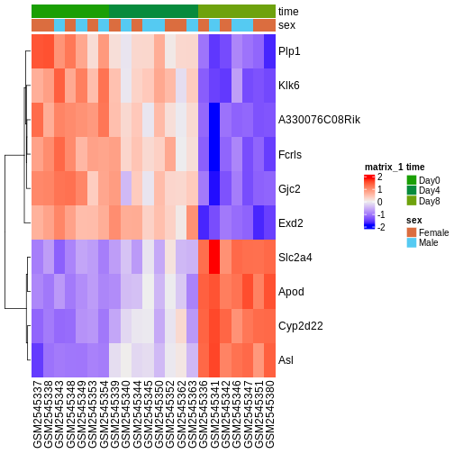

::::::::::::::::::::::::::::::::::::::: objectives

- Explain the steps involved in a differential expression analysis.
- Explain how to perform these steps in R, using DESeq2.

::::::::::::::::::::::::::::::::::::::::::::::::::

:::::::::::::::::::::::::::::::::::::::: questions

- How do we find differentially expressed genes?

::::::::::::::::::::::::::::::::::::::::::::::::::


:::::::::::::::::::::::::::::::::::::::::  callout

### Contribute!

This episode is intended to introduce the concepts required to perform
differential expression analysis with RNA-seq data. Explain concepts like
size factors, count modeling (Negative Binomial), dispersion, interpretation
of the test output, multiple testing correction.


::::::::::::::::::::::::::::::::::::::::::::::::::


```r
suppressPackageStartupMessages({
    library(SummarizedExperiment)
    library(DESeq2)
    library(ggplot2)
    library(ExploreModelMatrix)
    library(cowplot)
    library(ComplexHeatmap)
})
```

## Load data


```r
se <- readRDS("data/GSE96870_se.rds")
```

## Create DESeqDataSet


```r
dds <- DESeq2::DESeqDataSet(se[, se$tissue == "Cerebellum"],
                            design = ~ sex + time)
```

```{.warning}
Warning in DESeq2::DESeqDataSet(se[, se$tissue == "Cerebellum"], design = ~sex
+ : some variables in design formula are characters, converting to factors
```

## Run DESeq()

:::::::::::::::::::::::::::::::::::::::::  callout

### Contribute!

The concepts may be clearer if the steps of DESeq() are first performed
separately, followed by a note that they can be performed in a single step
using DESeq().


::::::::::::::::::::::::::::::::::::::::::::::::::


```r
dds <- DESeq2::DESeq(dds)
```

```{.output}
estimating size factors
```

```{.output}
estimating dispersions
```

```{.output}
gene-wise dispersion estimates
```

```{.output}
mean-dispersion relationship
```

```{.output}
final dispersion estimates
```

```{.output}
fitting model and testing
```

```r
plotDispEsts(dds)
```


## Extract results for specific contrasts

:::::::::::::::::::::::::::::::::::::::::  callout

### Contribute!

Refer back to the episode about experimental design.


::::::::::::::::::::::::::::::::::::::::::::::::::


```r
## Day 8 vs Day 0
resTime <- DESeq2::results(dds, contrast = c("time", "Day8", "Day0"))
summary(resTime)
```

```{.output}

out of 32652 with nonzero total read count
adjusted p-value < 0.1
LFC > 0 (up)       : 4472, 14%
LFC < 0 (down)     : 4276, 13%
outliers [1]       : 10, 0.031%
low counts [2]     : 8732, 27%
(mean count < 1)
[1] see 'cooksCutoff' argument of ?results
[2] see 'independentFiltering' argument of ?results
```

```r
head(resTime[order(resTime$pvalue), ])
```

```{.output}
log2 fold change (MLE): time Day8 vs Day0 
Wald test p-value: time Day8 vs Day0 
DataFrame with 6 rows and 6 columns
               baseMean log2FoldChange     lfcSE      stat      pvalue
              <numeric>      <numeric> <numeric> <numeric>   <numeric>
Asl             701.343        1.11733 0.0592541   18.8565 2.59885e-79
Apod          18765.146        1.44698 0.0805186   17.9708 3.30147e-72
Cyp2d22        2550.480        0.91020 0.0554756   16.4072 1.69794e-60
Klk6            546.503       -1.67190 0.1058989  -15.7877 3.78228e-56
Fcrls           184.235       -1.94701 0.1279847  -15.2128 2.90708e-52
A330076C08Rik   107.250       -1.74995 0.1154279  -15.1606 6.45112e-52
                     padj
                <numeric>
Asl           6.21386e-75
Apod          3.94690e-68
Cyp2d22       1.35326e-56
Klk6          2.26086e-52
Fcrls         1.39017e-48
A330076C08Rik 2.57077e-48
```

```r
DESeq2::plotMA(resTime)
```


```r
## Male vs Female
resSex <- DESeq2::results(dds, contrast = c("sex", "Male", "Female"))
summary(resSex)
```

```{.output}

out of 32652 with nonzero total read count
adjusted p-value < 0.1
LFC > 0 (up)       : 53, 0.16%
LFC < 0 (down)     : 71, 0.22%
outliers [1]       : 10, 0.031%
low counts [2]     : 13717, 42%
(mean count < 6)
[1] see 'cooksCutoff' argument of ?results
[2] see 'independentFiltering' argument of ?results
```

```r
head(resSex[order(resSex$pvalue), ])
```

```{.output}
log2 fold change (MLE): sex Male vs Female 
Wald test p-value: sex Male vs Female 
DataFrame with 6 rows and 6 columns
               baseMean log2FoldChange     lfcSE      stat       pvalue
              <numeric>      <numeric> <numeric> <numeric>    <numeric>
Xist         22603.0359      -11.60429  0.336282  -34.5076 6.16852e-261
Ddx3y         2072.9436       11.87241  0.397493   29.8683 5.08722e-196
Eif2s3y       1410.8750       12.62514  0.565216   22.3369 1.62066e-110
Kdm5d          692.1672       12.55386  0.593627   21.1477  2.89566e-99
Uty            667.4375       12.01728  0.593591   20.2451  3.92780e-91
LOC105243748    52.9669        9.08325  0.597624   15.1989  3.59432e-52
                     padj
                <numeric>
Xist         1.16739e-256
Ddx3y        4.81378e-192
Eif2s3y      1.02237e-106
Kdm5d         1.37001e-95
Uty           1.48667e-87
LOC105243748  1.13371e-48
```

```r
DESeq2::plotMA(resSex)
```


## Visualize selected set of genes

:::::::::::::::::::::::::::::::::::::::::  callout

### Contribute!

Here we intend to practice how to interpret the results from the
differential expression analysis. Refer back to the exploratory/QC episode.


::::::::::::::::::::::::::::::::::::::::::::::::::


```r
vsd <- DESeq2::vst(dds, blind = TRUE)

genes <- rownames(head(resTime[order(resTime$pvalue), ], 10))
heatmapData <- assay(vsd)[genes, ]
heatmapData <- t(scale(t(heatmapData)))
heatmapColAnnot <- data.frame(colData(vsd)[, c("time", "sex")])
idx <- order(vsd$time)
heatmapData <- heatmapData[, idx]
heatmapColAnnot <- HeatmapAnnotation(df = heatmapColAnnot[idx, ])
ComplexHeatmap::Heatmap(heatmapData,
                        top_annotation = heatmapColAnnot,
                        cluster_rows = TRUE, cluster_columns = FALSE)
```



:::::::::::::::::::::::::::::::::::::::: keypoints

- Key point 1

::::::::::::::::::::::::::::::::::::::::::::::::::


