::::::::::::::::::::::::::::::::::::::: objectives

- Explain the formula notation and design matrices.
- Explore different designs and learn how to interpret coefficients.

::::::::::::::::::::::::::::::::::::::::::::::::::

:::::::::::::::::::::::::::::::::::::::: questions

- How can one translate biological questions and comparisons to statistical terms suitable for use with RNA-seq analysis packages?

::::::::::::::::::::::::::::::::::::::::::::::::::


## Loading required packages and reading data

We start by loading a few packages that will be needed in this episode. 
In particular, the [ExploreModelMatrix](https://bioconductor.org/packages/ExploreModelMatrix/) package provides resources for exploring design matrices in a graphical fashion, for easier interpretation. 


``` r
suppressPackageStartupMessages({
    library(SummarizedExperiment)
    library(ExploreModelMatrix)
    library(dplyr)
    library(DESeq2)
})
```

Next, we read the metadata table for our data set. Because we want to explore many different design matrices, we will read in the 4th file we downloaded but haven't used yet: that for both Cerebellum and Spinal Cord samples (45 samples total). As seen in previous episodes, the metadata contains information about the age, sex, infection status, time of measurement and tissue of the collected samples. 
Note that Day0 always corresponds to non-infected samples, and that infected samples are collected on days 4 and 8.
Moreover, all mice have the same age (8 weeks). 
Hence, in the first part of this episode we consider only the sex, tissue and time variables further. 


``` r
meta <- read.csv("data/GSE96870_coldata_all.csv", row.names = 1)
# Here, for brevity we only print the first rows of the data.frame
head(meta)
```

``` output
                     title geo_accession     organism     age    sex
GSM2545336 CNS_RNA-seq_10C    GSM2545336 Mus musculus 8 weeks Female
GSM2545337 CNS_RNA-seq_11C    GSM2545337 Mus musculus 8 weeks Female
GSM2545338 CNS_RNA-seq_12C    GSM2545338 Mus musculus 8 weeks Female
GSM2545339 CNS_RNA-seq_13C    GSM2545339 Mus musculus 8 weeks Female
GSM2545340 CNS_RNA-seq_14C    GSM2545340 Mus musculus 8 weeks   Male
GSM2545341 CNS_RNA-seq_17C    GSM2545341 Mus musculus 8 weeks   Male
             infection  strain time     tissue mouse
GSM2545336  InfluenzaA C57BL/6 Day8 Cerebellum    14
GSM2545337 NonInfected C57BL/6 Day0 Cerebellum     9
GSM2545338 NonInfected C57BL/6 Day0 Cerebellum    10
GSM2545339  InfluenzaA C57BL/6 Day4 Cerebellum    15
GSM2545340  InfluenzaA C57BL/6 Day4 Cerebellum    18
GSM2545341  InfluenzaA C57BL/6 Day8 Cerebellum     6
```

``` r
table(meta$time, meta$infection)
```

``` output
      
       InfluenzaA NonInfected
  Day0          0          15
  Day4         16           0
  Day8         14           0
```

``` r
table(meta$age)
```

``` output

8 weeks 
     45 
```

We can start by visualizing the number of observations for each combination of the three predictor variables. 


``` r
vd <- VisualizeDesign(sampleData = meta, 
                      designFormula = ~ tissue + time + sex)
vd$cooccurrenceplots
```

``` output
$`tissue = Cerebellum`
```

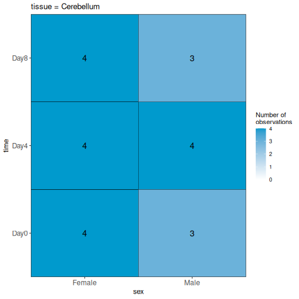

``` output

$`tissue = Spinalcord`
```

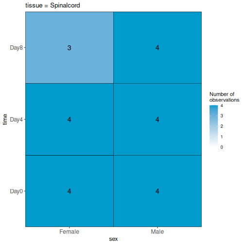

:::::::::::::::::::::::::::::::::::::::  challenge

### Challenge

Based on this visualization, would you say that the data set is balanced, or are there combinations of predictor variables that are severely over- or underrepresented?

::::::::::::::::::::::::::::::::::::::::::::::::::


## Compare males and females, non-infected spinal cord

Next, we will set up our first design matrix. 
Here, we will focus on the uninfected (Day0) spinal cord samples, and our aim is to compare the male and female mice. 
Thus, we first subset the metadata to only the samples of interest, and next set up and visualize the design matrix with a single predictor variable (sex). 
By defining the design formula as `~ sex`, we tell R to include an intercept in the design. 
This intercept will represent the 'baseline' level of the predictor variable, which in this case is selected to be the Female mice. 
If not explicitly specified, R will order the values of the predictor in alphabetical order and select the first one as the reference or baseline level. 


``` r
## Subset metadata
meta_noninf_spc <- meta %>% filter(time == "Day0" & 
                                       tissue == "Spinalcord")
meta_noninf_spc
```

``` output
                     title geo_accession     organism     age    sex
GSM2545356 CNS_RNA-seq_574    GSM2545356 Mus musculus 8 weeks   Male
GSM2545357 CNS_RNA-seq_575    GSM2545357 Mus musculus 8 weeks   Male
GSM2545358 CNS_RNA-seq_583    GSM2545358 Mus musculus 8 weeks Female
GSM2545361 CNS_RNA-seq_590    GSM2545361 Mus musculus 8 weeks   Male
GSM2545364 CNS_RNA-seq_709    GSM2545364 Mus musculus 8 weeks Female
GSM2545365 CNS_RNA-seq_710    GSM2545365 Mus musculus 8 weeks Female
GSM2545366 CNS_RNA-seq_711    GSM2545366 Mus musculus 8 weeks Female
GSM2545367 CNS_RNA-seq_713    GSM2545367 Mus musculus 8 weeks   Male
             infection  strain time     tissue mouse
GSM2545356 NonInfected C57BL/6 Day0 Spinalcord     2
GSM2545357 NonInfected C57BL/6 Day0 Spinalcord     3
GSM2545358 NonInfected C57BL/6 Day0 Spinalcord     4
GSM2545361 NonInfected C57BL/6 Day0 Spinalcord     7
GSM2545364 NonInfected C57BL/6 Day0 Spinalcord     8
GSM2545365 NonInfected C57BL/6 Day0 Spinalcord     9
GSM2545366 NonInfected C57BL/6 Day0 Spinalcord    10
GSM2545367 NonInfected C57BL/6 Day0 Spinalcord    11
```

``` r
## Use ExploreModelMatrix to create a design matrix and visualizations, given 
## the desired design formula. 
vd <- VisualizeDesign(sampleData = meta_noninf_spc, 
                      designFormula = ~ sex)
vd$designmatrix
```

``` output
           (Intercept) sexMale
GSM2545356           1       1
GSM2545357           1       1
GSM2545358           1       0
GSM2545361           1       1
GSM2545364           1       0
GSM2545365           1       0
GSM2545366           1       0
GSM2545367           1       1
```

``` r
vd$plotlist
```

``` output
[[1]]
```


``` r
## Note that we can also generate the design matrix like this
model.matrix(~ sex, data = meta_noninf_spc)
```

``` output
           (Intercept) sexMale
GSM2545356           1       1
GSM2545357           1       1
GSM2545358           1       0
GSM2545361           1       1
GSM2545364           1       0
GSM2545365           1       0
GSM2545366           1       0
GSM2545367           1       1
attr(,"assign")
[1] 0 1
attr(,"contrasts")
attr(,"contrasts")$sex
[1] "contr.treatment"
```

:::::::::::::::::::::::::::::::::::::::  challenge

### Challenge

With this design, what is the interpretation of the `sexMale` coefficient?

::::::::::::::::::::::::::::::::::::::::::::::::::

:::::::::::::::::::::::::::::::::::::::  challenge

### Challenge

Set up the design formula to compare male and female spinal cord samples from Day0 as above, but instruct R to not include an intercept in the model. How does this change the interpretation of the coefficients? What contrast would have to be specified to compare the mean expression of a gene between male and female mice? 

:::::::::::::::  solution

### Solution


``` r
meta_noninf_spc <- meta %>% filter(time == "Day0" & 
                                       tissue == "Spinalcord")
meta_noninf_spc
```

``` output
                     title geo_accession     organism     age    sex
GSM2545356 CNS_RNA-seq_574    GSM2545356 Mus musculus 8 weeks   Male
GSM2545357 CNS_RNA-seq_575    GSM2545357 Mus musculus 8 weeks   Male
GSM2545358 CNS_RNA-seq_583    GSM2545358 Mus musculus 8 weeks Female
GSM2545361 CNS_RNA-seq_590    GSM2545361 Mus musculus 8 weeks   Male
GSM2545364 CNS_RNA-seq_709    GSM2545364 Mus musculus 8 weeks Female
GSM2545365 CNS_RNA-seq_710    GSM2545365 Mus musculus 8 weeks Female
GSM2545366 CNS_RNA-seq_711    GSM2545366 Mus musculus 8 weeks Female
GSM2545367 CNS_RNA-seq_713    GSM2545367 Mus musculus 8 weeks   Male
             infection  strain time     tissue mouse
GSM2545356 NonInfected C57BL/6 Day0 Spinalcord     2
GSM2545357 NonInfected C57BL/6 Day0 Spinalcord     3
GSM2545358 NonInfected C57BL/6 Day0 Spinalcord     4
GSM2545361 NonInfected C57BL/6 Day0 Spinalcord     7
GSM2545364 NonInfected C57BL/6 Day0 Spinalcord     8
GSM2545365 NonInfected C57BL/6 Day0 Spinalcord     9
GSM2545366 NonInfected C57BL/6 Day0 Spinalcord    10
GSM2545367 NonInfected C57BL/6 Day0 Spinalcord    11
```

``` r
vd <- VisualizeDesign(sampleData = meta_noninf_spc, 
                      designFormula = ~ 0 + sex)
vd$designmatrix
```

``` output
           sexFemale sexMale
GSM2545356         0       1
GSM2545357         0       1
GSM2545358         1       0
GSM2545361         0       1
GSM2545364         1       0
GSM2545365         1       0
GSM2545366         1       0
GSM2545367         0       1
```

``` r
vd$plotlist
```

``` output
[[1]]
```

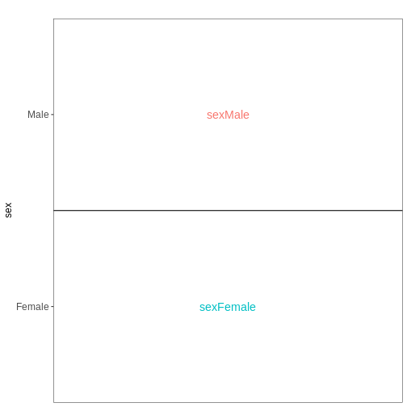

:::::::::::::::::::::::::

::::::::::::::::::::::::::::::::::::::::::::::::::

:::::::::::::::::::::::::::::::::::::::  challenge

### Challenge

Set up the design formula to compare the three time points (Day0, Day4, Day8) in the male spinal cord samples, and visualize it using `ExploreModelMatrix`.

:::::::::::::::  solution

### Solution


``` r
meta_male_spc <- meta %>% filter(sex == "Male" & tissue == "Spinalcord")
meta_male_spc
```

``` output
                     title geo_accession     organism     age  sex   infection
GSM2545355 CNS_RNA-seq_571    GSM2545355 Mus musculus 8 weeks Male  InfluenzaA
GSM2545356 CNS_RNA-seq_574    GSM2545356 Mus musculus 8 weeks Male NonInfected
GSM2545357 CNS_RNA-seq_575    GSM2545357 Mus musculus 8 weeks Male NonInfected
GSM2545360 CNS_RNA-seq_589    GSM2545360 Mus musculus 8 weeks Male  InfluenzaA
GSM2545361 CNS_RNA-seq_590    GSM2545361 Mus musculus 8 weeks Male NonInfected
GSM2545367 CNS_RNA-seq_713    GSM2545367 Mus musculus 8 weeks Male NonInfected
GSM2545368 CNS_RNA-seq_728    GSM2545368 Mus musculus 8 weeks Male  InfluenzaA
GSM2545369 CNS_RNA-seq_729    GSM2545369 Mus musculus 8 weeks Male  InfluenzaA
GSM2545372 CNS_RNA-seq_733    GSM2545372 Mus musculus 8 weeks Male  InfluenzaA
GSM2545373 CNS_RNA-seq_735    GSM2545373 Mus musculus 8 weeks Male  InfluenzaA
GSM2545378 CNS_RNA-seq_742    GSM2545378 Mus musculus 8 weeks Male  InfluenzaA
GSM2545379 CNS_RNA-seq_743    GSM2545379 Mus musculus 8 weeks Male  InfluenzaA
            strain time     tissue mouse
GSM2545355 C57BL/6 Day4 Spinalcord     1
GSM2545356 C57BL/6 Day0 Spinalcord     2
GSM2545357 C57BL/6 Day0 Spinalcord     3
GSM2545360 C57BL/6 Day8 Spinalcord     6
GSM2545361 C57BL/6 Day0 Spinalcord     7
GSM2545367 C57BL/6 Day0 Spinalcord    11
GSM2545368 C57BL/6 Day4 Spinalcord    12
GSM2545369 C57BL/6 Day4 Spinalcord    13
GSM2545372 C57BL/6 Day8 Spinalcord    17
GSM2545373 C57BL/6 Day4 Spinalcord    18
GSM2545378 C57BL/6 Day8 Spinalcord    23
GSM2545379 C57BL/6 Day8 Spinalcord    24
```

``` r
vd <- VisualizeDesign(sampleData = meta_male_spc, designFormula = ~ time)
vd$designmatrix
```

``` output
           (Intercept) timeDay4 timeDay8
GSM2545355           1        1        0
GSM2545356           1        0        0
GSM2545357           1        0        0
GSM2545360           1        0        1
GSM2545361           1        0        0
GSM2545367           1        0        0
GSM2545368           1        1        0
GSM2545369           1        1        0
GSM2545372           1        0        1
GSM2545373           1        1        0
GSM2545378           1        0        1
GSM2545379           1        0        1
```

``` r
vd$plotlist
```

``` output
[[1]]
```

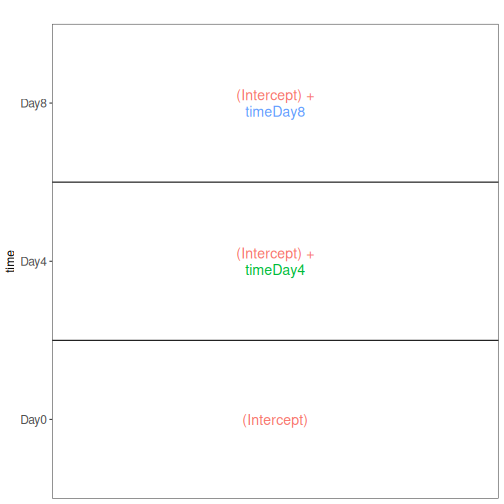

:::::::::::::::::::::::::

::::::::::::::::::::::::::::::::::::::::::::::::::

## Factorial design without interactions

Next, we again consider only non-infected mice, but fit a model incorporating both sex and tissue as predictors. 
We assume that the tissue differences are the same for both male and female mice, and consequently fit an additive model, without interaction terms. 


``` r
meta_noninf <- meta %>% filter(time == "Day0")
meta_noninf
```

``` output
                     title geo_accession     organism     age    sex
GSM2545337 CNS_RNA-seq_11C    GSM2545337 Mus musculus 8 weeks Female
GSM2545338 CNS_RNA-seq_12C    GSM2545338 Mus musculus 8 weeks Female
GSM2545343 CNS_RNA-seq_20C    GSM2545343 Mus musculus 8 weeks   Male
GSM2545348 CNS_RNA-seq_27C    GSM2545348 Mus musculus 8 weeks Female
GSM2545349 CNS_RNA-seq_28C    GSM2545349 Mus musculus 8 weeks   Male
GSM2545353  CNS_RNA-seq_3C    GSM2545353 Mus musculus 8 weeks Female
GSM2545354  CNS_RNA-seq_4C    GSM2545354 Mus musculus 8 weeks   Male
GSM2545356 CNS_RNA-seq_574    GSM2545356 Mus musculus 8 weeks   Male
GSM2545357 CNS_RNA-seq_575    GSM2545357 Mus musculus 8 weeks   Male
GSM2545358 CNS_RNA-seq_583    GSM2545358 Mus musculus 8 weeks Female
GSM2545361 CNS_RNA-seq_590    GSM2545361 Mus musculus 8 weeks   Male
GSM2545364 CNS_RNA-seq_709    GSM2545364 Mus musculus 8 weeks Female
GSM2545365 CNS_RNA-seq_710    GSM2545365 Mus musculus 8 weeks Female
GSM2545366 CNS_RNA-seq_711    GSM2545366 Mus musculus 8 weeks Female
GSM2545367 CNS_RNA-seq_713    GSM2545367 Mus musculus 8 weeks   Male
             infection  strain time     tissue mouse
GSM2545337 NonInfected C57BL/6 Day0 Cerebellum     9
GSM2545338 NonInfected C57BL/6 Day0 Cerebellum    10
GSM2545343 NonInfected C57BL/6 Day0 Cerebellum    11
GSM2545348 NonInfected C57BL/6 Day0 Cerebellum     8
GSM2545349 NonInfected C57BL/6 Day0 Cerebellum     7
GSM2545353 NonInfected C57BL/6 Day0 Cerebellum     4
GSM2545354 NonInfected C57BL/6 Day0 Cerebellum     2
GSM2545356 NonInfected C57BL/6 Day0 Spinalcord     2
GSM2545357 NonInfected C57BL/6 Day0 Spinalcord     3
GSM2545358 NonInfected C57BL/6 Day0 Spinalcord     4
GSM2545361 NonInfected C57BL/6 Day0 Spinalcord     7
GSM2545364 NonInfected C57BL/6 Day0 Spinalcord     8
GSM2545365 NonInfected C57BL/6 Day0 Spinalcord     9
GSM2545366 NonInfected C57BL/6 Day0 Spinalcord    10
GSM2545367 NonInfected C57BL/6 Day0 Spinalcord    11
```

``` r
vd <- VisualizeDesign(sampleData = meta_noninf, 
                      designFormula = ~ sex + tissue)
vd$designmatrix
```

``` output
           (Intercept) sexMale tissueSpinalcord
GSM2545337           1       0                0
GSM2545338           1       0                0
GSM2545343           1       1                0
GSM2545348           1       0                0
GSM2545349           1       1                0
GSM2545353           1       0                0
GSM2545354           1       1                0
GSM2545356           1       1                1
GSM2545357           1       1                1
GSM2545358           1       0                1
GSM2545361           1       1                1
GSM2545364           1       0                1
GSM2545365           1       0                1
GSM2545366           1       0                1
GSM2545367           1       1                1
```

``` r
vd$plotlist
```

``` output
[[1]]
```

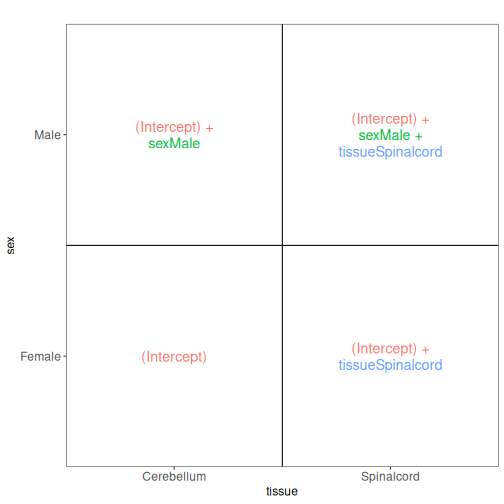

## Factorial design with interactions

In the previous model, we assumed that the tissue differences were the same for both male and female mice. 
To allow for the estimation of sex-specific tissue differences (at the expense of having one additional coefficient to estimate from the data), we can include an interaction term in the model. 


``` r
meta_noninf <- meta %>% filter(time == "Day0")
meta_noninf
```

``` output
                     title geo_accession     organism     age    sex
GSM2545337 CNS_RNA-seq_11C    GSM2545337 Mus musculus 8 weeks Female
GSM2545338 CNS_RNA-seq_12C    GSM2545338 Mus musculus 8 weeks Female
GSM2545343 CNS_RNA-seq_20C    GSM2545343 Mus musculus 8 weeks   Male
GSM2545348 CNS_RNA-seq_27C    GSM2545348 Mus musculus 8 weeks Female
GSM2545349 CNS_RNA-seq_28C    GSM2545349 Mus musculus 8 weeks   Male
GSM2545353  CNS_RNA-seq_3C    GSM2545353 Mus musculus 8 weeks Female
GSM2545354  CNS_RNA-seq_4C    GSM2545354 Mus musculus 8 weeks   Male
GSM2545356 CNS_RNA-seq_574    GSM2545356 Mus musculus 8 weeks   Male
GSM2545357 CNS_RNA-seq_575    GSM2545357 Mus musculus 8 weeks   Male
GSM2545358 CNS_RNA-seq_583    GSM2545358 Mus musculus 8 weeks Female
GSM2545361 CNS_RNA-seq_590    GSM2545361 Mus musculus 8 weeks   Male
GSM2545364 CNS_RNA-seq_709    GSM2545364 Mus musculus 8 weeks Female
GSM2545365 CNS_RNA-seq_710    GSM2545365 Mus musculus 8 weeks Female
GSM2545366 CNS_RNA-seq_711    GSM2545366 Mus musculus 8 weeks Female
GSM2545367 CNS_RNA-seq_713    GSM2545367 Mus musculus 8 weeks   Male
             infection  strain time     tissue mouse
GSM2545337 NonInfected C57BL/6 Day0 Cerebellum     9
GSM2545338 NonInfected C57BL/6 Day0 Cerebellum    10
GSM2545343 NonInfected C57BL/6 Day0 Cerebellum    11
GSM2545348 NonInfected C57BL/6 Day0 Cerebellum     8
GSM2545349 NonInfected C57BL/6 Day0 Cerebellum     7
GSM2545353 NonInfected C57BL/6 Day0 Cerebellum     4
GSM2545354 NonInfected C57BL/6 Day0 Cerebellum     2
GSM2545356 NonInfected C57BL/6 Day0 Spinalcord     2
GSM2545357 NonInfected C57BL/6 Day0 Spinalcord     3
GSM2545358 NonInfected C57BL/6 Day0 Spinalcord     4
GSM2545361 NonInfected C57BL/6 Day0 Spinalcord     7
GSM2545364 NonInfected C57BL/6 Day0 Spinalcord     8
GSM2545365 NonInfected C57BL/6 Day0 Spinalcord     9
GSM2545366 NonInfected C57BL/6 Day0 Spinalcord    10
GSM2545367 NonInfected C57BL/6 Day0 Spinalcord    11
```

``` r
## Define a design including an interaction term
## Note that ~ sex * tissue is equivalent to 
## ~ sex + tissue + sex:tissue
vd <- VisualizeDesign(sampleData = meta_noninf, 
                      designFormula = ~ sex * tissue)
vd$designmatrix
```

``` output
           (Intercept) sexMale tissueSpinalcord sexMale:tissueSpinalcord
GSM2545337           1       0                0                        0
GSM2545338           1       0                0                        0
GSM2545343           1       1                0                        0
GSM2545348           1       0                0                        0
GSM2545349           1       1                0                        0
GSM2545353           1       0                0                        0
GSM2545354           1       1                0                        0
GSM2545356           1       1                1                        1
GSM2545357           1       1                1                        1
GSM2545358           1       0                1                        0
GSM2545361           1       1                1                        1
GSM2545364           1       0                1                        0
GSM2545365           1       0                1                        0
GSM2545366           1       0                1                        0
GSM2545367           1       1                1                        1
```

``` r
vd$plotlist
```

``` output
[[1]]
```

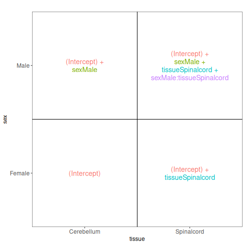

## Combining multiple factors into one

Sometimes, for experiments with multiple factors, it is easier to interpret coefficients and set up contrasts of interest if the factors are combined into one. 
Let's consider the previous example again, using this approach:


``` r
meta_noninf <- meta %>% filter(time == "Day0")
meta_noninf$sex_tissue <- paste0(meta_noninf$sex, "_", meta_noninf$tissue)
meta_noninf
```

``` output
                     title geo_accession     organism     age    sex
GSM2545337 CNS_RNA-seq_11C    GSM2545337 Mus musculus 8 weeks Female
GSM2545338 CNS_RNA-seq_12C    GSM2545338 Mus musculus 8 weeks Female
GSM2545343 CNS_RNA-seq_20C    GSM2545343 Mus musculus 8 weeks   Male
GSM2545348 CNS_RNA-seq_27C    GSM2545348 Mus musculus 8 weeks Female
GSM2545349 CNS_RNA-seq_28C    GSM2545349 Mus musculus 8 weeks   Male
GSM2545353  CNS_RNA-seq_3C    GSM2545353 Mus musculus 8 weeks Female
GSM2545354  CNS_RNA-seq_4C    GSM2545354 Mus musculus 8 weeks   Male
GSM2545356 CNS_RNA-seq_574    GSM2545356 Mus musculus 8 weeks   Male
GSM2545357 CNS_RNA-seq_575    GSM2545357 Mus musculus 8 weeks   Male
GSM2545358 CNS_RNA-seq_583    GSM2545358 Mus musculus 8 weeks Female
GSM2545361 CNS_RNA-seq_590    GSM2545361 Mus musculus 8 weeks   Male
GSM2545364 CNS_RNA-seq_709    GSM2545364 Mus musculus 8 weeks Female
GSM2545365 CNS_RNA-seq_710    GSM2545365 Mus musculus 8 weeks Female
GSM2545366 CNS_RNA-seq_711    GSM2545366 Mus musculus 8 weeks Female
GSM2545367 CNS_RNA-seq_713    GSM2545367 Mus musculus 8 weeks   Male
             infection  strain time     tissue mouse        sex_tissue
GSM2545337 NonInfected C57BL/6 Day0 Cerebellum     9 Female_Cerebellum
GSM2545338 NonInfected C57BL/6 Day0 Cerebellum    10 Female_Cerebellum
GSM2545343 NonInfected C57BL/6 Day0 Cerebellum    11   Male_Cerebellum
GSM2545348 NonInfected C57BL/6 Day0 Cerebellum     8 Female_Cerebellum
GSM2545349 NonInfected C57BL/6 Day0 Cerebellum     7   Male_Cerebellum
GSM2545353 NonInfected C57BL/6 Day0 Cerebellum     4 Female_Cerebellum
GSM2545354 NonInfected C57BL/6 Day0 Cerebellum     2   Male_Cerebellum
GSM2545356 NonInfected C57BL/6 Day0 Spinalcord     2   Male_Spinalcord
GSM2545357 NonInfected C57BL/6 Day0 Spinalcord     3   Male_Spinalcord
GSM2545358 NonInfected C57BL/6 Day0 Spinalcord     4 Female_Spinalcord
GSM2545361 NonInfected C57BL/6 Day0 Spinalcord     7   Male_Spinalcord
GSM2545364 NonInfected C57BL/6 Day0 Spinalcord     8 Female_Spinalcord
GSM2545365 NonInfected C57BL/6 Day0 Spinalcord     9 Female_Spinalcord
GSM2545366 NonInfected C57BL/6 Day0 Spinalcord    10 Female_Spinalcord
GSM2545367 NonInfected C57BL/6 Day0 Spinalcord    11   Male_Spinalcord
```

``` r
vd <- VisualizeDesign(sampleData = meta_noninf, 
                      designFormula = ~ 0 + sex_tissue)
vd$designmatrix
```

``` output
           sex_tissueFemale_Cerebellum sex_tissueFemale_Spinalcord
GSM2545337                           1                           0
GSM2545338                           1                           0
GSM2545343                           0                           0
GSM2545348                           1                           0
GSM2545349                           0                           0
GSM2545353                           1                           0
GSM2545354                           0                           0
GSM2545356                           0                           0
GSM2545357                           0                           0
GSM2545358                           0                           1
GSM2545361                           0                           0
GSM2545364                           0                           1
GSM2545365                           0                           1
GSM2545366                           0                           1
GSM2545367                           0                           0
           sex_tissueMale_Cerebellum sex_tissueMale_Spinalcord
GSM2545337                         0                         0
GSM2545338                         0                         0
GSM2545343                         1                         0
GSM2545348                         0                         0
GSM2545349                         1                         0
GSM2545353                         0                         0
GSM2545354                         1                         0
GSM2545356                         0                         1
GSM2545357                         0                         1
GSM2545358                         0                         0
GSM2545361                         0                         1
GSM2545364                         0                         0
GSM2545365                         0                         0
GSM2545366                         0                         0
GSM2545367                         0                         1
```

``` r
vd$plotlist
```

``` output
[[1]]
```

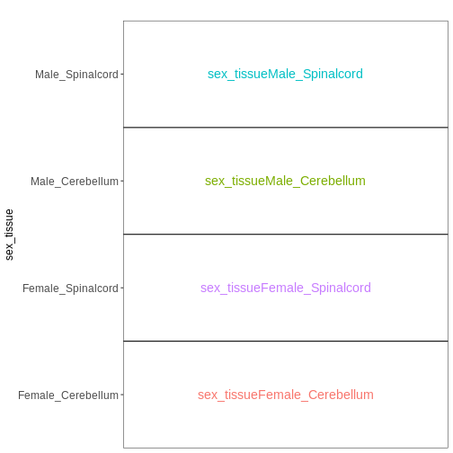


## Paired design

In this particular data set the samples are paired - the same mice have contributed both the cerebellum and spinal cord samples. 
This information was not included in the previous models. 
However, accounting for it can increase power to detect tissue differences by eliminating variability in baseline expression levels between mice. 
Here, we define a paired design for the female non-infected mice, aimed at testing for differences between tissues after accounting for baseline differences between mice.


``` r
meta_fem_day0 <- meta %>% filter(sex == "Female" & 
                                     time == "Day0")

# ensure that mouse is treated as a categorical variable
meta_fem_day0$mouse <- factor(meta_fem_day0$mouse)

meta_fem_day0
```

``` output
                     title geo_accession     organism     age    sex
GSM2545337 CNS_RNA-seq_11C    GSM2545337 Mus musculus 8 weeks Female
GSM2545338 CNS_RNA-seq_12C    GSM2545338 Mus musculus 8 weeks Female
GSM2545348 CNS_RNA-seq_27C    GSM2545348 Mus musculus 8 weeks Female
GSM2545353  CNS_RNA-seq_3C    GSM2545353 Mus musculus 8 weeks Female
GSM2545358 CNS_RNA-seq_583    GSM2545358 Mus musculus 8 weeks Female
GSM2545364 CNS_RNA-seq_709    GSM2545364 Mus musculus 8 weeks Female
GSM2545365 CNS_RNA-seq_710    GSM2545365 Mus musculus 8 weeks Female
GSM2545366 CNS_RNA-seq_711    GSM2545366 Mus musculus 8 weeks Female
             infection  strain time     tissue mouse
GSM2545337 NonInfected C57BL/6 Day0 Cerebellum     9
GSM2545338 NonInfected C57BL/6 Day0 Cerebellum    10
GSM2545348 NonInfected C57BL/6 Day0 Cerebellum     8
GSM2545353 NonInfected C57BL/6 Day0 Cerebellum     4
GSM2545358 NonInfected C57BL/6 Day0 Spinalcord     4
GSM2545364 NonInfected C57BL/6 Day0 Spinalcord     8
GSM2545365 NonInfected C57BL/6 Day0 Spinalcord     9
GSM2545366 NonInfected C57BL/6 Day0 Spinalcord    10
```

``` r
vd <- VisualizeDesign(sampleData = meta_fem_day0,
                      designFormula = ~ mouse + tissue)
vd$designmatrix
```

``` output
           (Intercept) mouse8 mouse9 mouse10 tissueSpinalcord
GSM2545337           1      0      1       0                0
GSM2545338           1      0      0       1                0
GSM2545348           1      1      0       0                0
GSM2545353           1      0      0       0                0
GSM2545358           1      0      0       0                1
GSM2545364           1      1      0       0                1
GSM2545365           1      0      1       0                1
GSM2545366           1      0      0       1                1
```

``` r
vd$plotlist
```

``` output
[[1]]
```

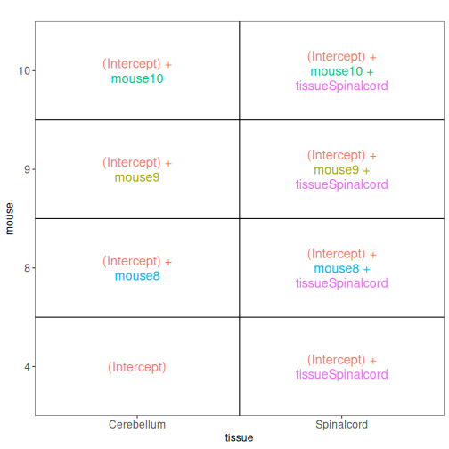

## Within- and between-subject comparisons

In some situations, we need to combine the types of models considered above. 
For example, let's say that we want to investigate if the tissue differences are different for infected and non-infected female mice. 
In this case, each mice only contributes to one of the infection groups (each mice is either infected or non-infected), but contributes both a cerebellum and a spinal cord sample.
One way to view this type of design is as two paired experiments, one for each infection group (see the [edgeR user guide section 3.5](https://www.bioconductor.org/packages/release/bioc/vignettes/edgeR/inst/doc/edgeRUsersGuide.pdf)).
We can then easily compare the two tissues in each infection group, and contrast the tissue differences between the infection groups. 


``` r
meta_fem_day04 <- meta %>% 
    filter(sex == "Female" & 
               time %in% c("Day0", "Day4")) %>%
    droplevels()
# ensure that mouse is treated as a categorical variable
meta_fem_day04$mouse <- factor(meta_fem_day04$mouse)

meta_fem_day04
```

``` output
                     title geo_accession     organism     age    sex
GSM2545337 CNS_RNA-seq_11C    GSM2545337 Mus musculus 8 weeks Female
GSM2545338 CNS_RNA-seq_12C    GSM2545338 Mus musculus 8 weeks Female
GSM2545339 CNS_RNA-seq_13C    GSM2545339 Mus musculus 8 weeks Female
GSM2545344 CNS_RNA-seq_21C    GSM2545344 Mus musculus 8 weeks Female
GSM2545348 CNS_RNA-seq_27C    GSM2545348 Mus musculus 8 weeks Female
GSM2545352 CNS_RNA-seq_30C    GSM2545352 Mus musculus 8 weeks Female
GSM2545353  CNS_RNA-seq_3C    GSM2545353 Mus musculus 8 weeks Female
GSM2545358 CNS_RNA-seq_583    GSM2545358 Mus musculus 8 weeks Female
GSM2545362  CNS_RNA-seq_5C    GSM2545362 Mus musculus 8 weeks Female
GSM2545364 CNS_RNA-seq_709    GSM2545364 Mus musculus 8 weeks Female
GSM2545365 CNS_RNA-seq_710    GSM2545365 Mus musculus 8 weeks Female
GSM2545366 CNS_RNA-seq_711    GSM2545366 Mus musculus 8 weeks Female
GSM2545371 CNS_RNA-seq_731    GSM2545371 Mus musculus 8 weeks Female
GSM2545375 CNS_RNA-seq_738    GSM2545375 Mus musculus 8 weeks Female
GSM2545376 CNS_RNA-seq_740    GSM2545376 Mus musculus 8 weeks Female
GSM2545377 CNS_RNA-seq_741    GSM2545377 Mus musculus 8 weeks Female
             infection  strain time     tissue mouse
GSM2545337 NonInfected C57BL/6 Day0 Cerebellum     9
GSM2545338 NonInfected C57BL/6 Day0 Cerebellum    10
GSM2545339  InfluenzaA C57BL/6 Day4 Cerebellum    15
GSM2545344  InfluenzaA C57BL/6 Day4 Cerebellum    22
GSM2545348 NonInfected C57BL/6 Day0 Cerebellum     8
GSM2545352  InfluenzaA C57BL/6 Day4 Cerebellum    21
GSM2545353 NonInfected C57BL/6 Day0 Cerebellum     4
GSM2545358 NonInfected C57BL/6 Day0 Spinalcord     4
GSM2545362  InfluenzaA C57BL/6 Day4 Cerebellum    20
GSM2545364 NonInfected C57BL/6 Day0 Spinalcord     8
GSM2545365 NonInfected C57BL/6 Day0 Spinalcord     9
GSM2545366 NonInfected C57BL/6 Day0 Spinalcord    10
GSM2545371  InfluenzaA C57BL/6 Day4 Spinalcord    15
GSM2545375  InfluenzaA C57BL/6 Day4 Spinalcord    20
GSM2545376  InfluenzaA C57BL/6 Day4 Spinalcord    21
GSM2545377  InfluenzaA C57BL/6 Day4 Spinalcord    22
```

``` r
design <- model.matrix(~ mouse, data = meta_fem_day04)
design <- cbind(design, 
                Spc.Day0 = meta_fem_day04$tissue == "Spinalcord" & 
                    meta_fem_day04$time == "Day0",
                Spc.Day4 = meta_fem_day04$tissue == "Spinalcord" & 
                    meta_fem_day04$time == "Day4")
rownames(design) <- rownames(meta_fem_day04)
design
```

``` output
           (Intercept) mouse8 mouse9 mouse10 mouse15 mouse20 mouse21 mouse22
GSM2545337           1      0      1       0       0       0       0       0
GSM2545338           1      0      0       1       0       0       0       0
GSM2545339           1      0      0       0       1       0       0       0
GSM2545344           1      0      0       0       0       0       0       1
GSM2545348           1      1      0       0       0       0       0       0
GSM2545352           1      0      0       0       0       0       1       0
GSM2545353           1      0      0       0       0       0       0       0
GSM2545358           1      0      0       0       0       0       0       0
GSM2545362           1      0      0       0       0       1       0       0
GSM2545364           1      1      0       0       0       0       0       0
GSM2545365           1      0      1       0       0       0       0       0
GSM2545366           1      0      0       1       0       0       0       0
GSM2545371           1      0      0       0       1       0       0       0
GSM2545375           1      0      0       0       0       1       0       0
GSM2545376           1      0      0       0       0       0       1       0
GSM2545377           1      0      0       0       0       0       0       1
           Spc.Day0 Spc.Day4
GSM2545337        0        0
GSM2545338        0        0
GSM2545339        0        0
GSM2545344        0        0
GSM2545348        0        0
GSM2545352        0        0
GSM2545353        0        0
GSM2545358        1        0
GSM2545362        0        0
GSM2545364        1        0
GSM2545365        1        0
GSM2545366        1        0
GSM2545371        0        1
GSM2545375        0        1
GSM2545376        0        1
GSM2545377        0        1
```

``` r
vd <- VisualizeDesign(sampleData = meta_fem_day04 %>%
                          select(time, tissue, mouse),
                      designFormula = NULL, 
                      designMatrix = design, flipCoordFitted = FALSE)
vd$designmatrix
```

``` output
           (Intercept) mouse8 mouse9 mouse10 mouse15 mouse20 mouse21 mouse22
GSM2545337           1      0      1       0       0       0       0       0
GSM2545338           1      0      0       1       0       0       0       0
GSM2545339           1      0      0       0       1       0       0       0
GSM2545344           1      0      0       0       0       0       0       1
GSM2545348           1      1      0       0       0       0       0       0
GSM2545352           1      0      0       0       0       0       1       0
GSM2545353           1      0      0       0       0       0       0       0
GSM2545358           1      0      0       0       0       0       0       0
GSM2545362           1      0      0       0       0       1       0       0
GSM2545364           1      1      0       0       0       0       0       0
GSM2545365           1      0      1       0       0       0       0       0
GSM2545366           1      0      0       1       0       0       0       0
GSM2545371           1      0      0       0       1       0       0       0
GSM2545375           1      0      0       0       0       1       0       0
GSM2545376           1      0      0       0       0       0       1       0
GSM2545377           1      0      0       0       0       0       0       1
           Spc.Day0 Spc.Day4
GSM2545337        0        0
GSM2545338        0        0
GSM2545339        0        0
GSM2545344        0        0
GSM2545348        0        0
GSM2545352        0        0
GSM2545353        0        0
GSM2545358        1        0
GSM2545362        0        0
GSM2545364        1        0
GSM2545365        1        0
GSM2545366        1        0
GSM2545371        0        1
GSM2545375        0        1
GSM2545376        0        1
GSM2545377        0        1
```

``` r
vd$plotlist
```

``` output
$`time = Day0`
```

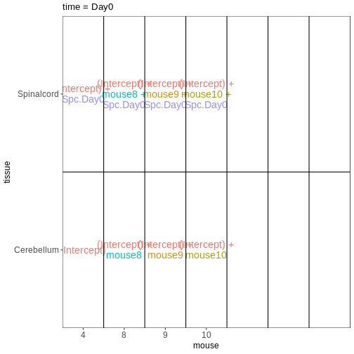

``` output

$`time = Day4`
```

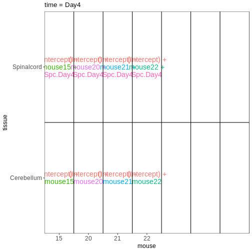

## How does this relate to the DESeq2 analysis we did in the previous episode? 

Now that we have learnt more about interpreting design matrices, let's look back to the differential expression analysis we performed in the previous episode. 
We will repeat the main lines of code here.


``` r
se <- readRDS("data/GSE96870_se.rds")
se <- se[rowSums(assay(se, "counts")) > 5, ]
dds <- DESeq2::DESeqDataSet(se, design = ~ sex + time)
dds <- DESeq(dds)
```

``` output
estimating size factors
```

``` output
estimating dispersions
```

``` output
gene-wise dispersion estimates
```

``` output
mean-dispersion relationship
```

``` output
final dispersion estimates
```

``` output
fitting model and testing
```

`DESeq2` stores the design matrix in the object: 


``` r
attr(dds, "modelMatrix")
```

``` output
               Intercept sex_Male_vs_Female time_Day4_vs_Day0 time_Day8_vs_Day0
Female_Day0_9          1                  0                 0                 0
Female_Day0_10         1                  0                 0                 0
Female_Day0_8          1                  0                 0                 0
Female_Day0_4          1                  0                 0                 0
Male_Day0_11           1                  1                 0                 0
Male_Day0_7            1                  1                 0                 0
Male_Day0_2            1                  1                 0                 0
Female_Day4_15         1                  0                 1                 0
Female_Day4_22         1                  0                 1                 0
Female_Day4_21         1                  0                 1                 0
Female_Day4_20         1                  0                 1                 0
Male_Day4_18           1                  1                 1                 0
Male_Day4_13           1                  1                 1                 0
Male_Day4_1            1                  1                 1                 0
Male_Day4_12           1                  1                 1                 0
Female_Day8_14         1                  0                 0                 1
Female_Day8_5          1                  0                 0                 1
Female_Day8_16         1                  0                 0                 1
Female_Day8_19         1                  0                 0                 1
Male_Day8_6            1                  1                 0                 1
Male_Day8_23           1                  1                 0                 1
Male_Day8_24           1                  1                 0                 1
attr(,"assign")
[1] 0 1 2 2
attr(,"contrasts")
attr(,"contrasts")$sex
[1] "contr.treatment"

attr(,"contrasts")$time
[1] "contr.treatment"
```

The column names can be obtained via the `resultsNames` function:


``` r
resultsNames(dds)
```

``` output
[1] "Intercept"          "sex_Male_vs_Female" "time_Day4_vs_Day0" 
[4] "time_Day8_vs_Day0" 
```

Let's visualize this design: 


``` r
vd <- VisualizeDesign(sampleData = colData(dds)[, c("sex", "time")], 
                      designMatrix = attr(dds, "modelMatrix"), 
                      flipCoordFitted = TRUE)
vd$plotlist
```

``` output
[[1]]
```


In the previous episode, we performed a test comparing Day8 samples to Day0 samples:


``` r
resTime <- results(dds, contrast = c("time", "Day8", "Day0"))
```

From the figure above, we see that this comparison is represented by the `time_Day8_vs_Day0` coefficient, which corresponds to the fourth column in the design matrix. 
Thus, an alternative way of specifying the contrast for the test would be: 


``` r
resTimeNum <- results(dds, contrast = c(0, 0, 0, 1))
```

Let's check if the results are comparable: 


``` r
summary(resTime)
```

``` output

out of 27430 with nonzero total read count
adjusted p-value < 0.1
LFC > 0 (up)       : 4472, 16%
LFC < 0 (down)     : 4282, 16%
outliers [1]       : 10, 0.036%
low counts [2]     : 3723, 14%
(mean count < 1)
[1] see 'cooksCutoff' argument of ?results
[2] see 'independentFiltering' argument of ?results
```

``` r
summary(resTimeNum)
```

``` output

out of 27430 with nonzero total read count
adjusted p-value < 0.1
LFC > 0 (up)       : 4472, 16%
LFC < 0 (down)     : 4282, 16%
outliers [1]       : 10, 0.036%
low counts [2]     : 3723, 14%
(mean count < 1)
[1] see 'cooksCutoff' argument of ?results
[2] see 'independentFiltering' argument of ?results
```

``` r
## logFC
plot(resTime$log2FoldChange, resTimeNum$log2FoldChange)
abline(0, 1)
```

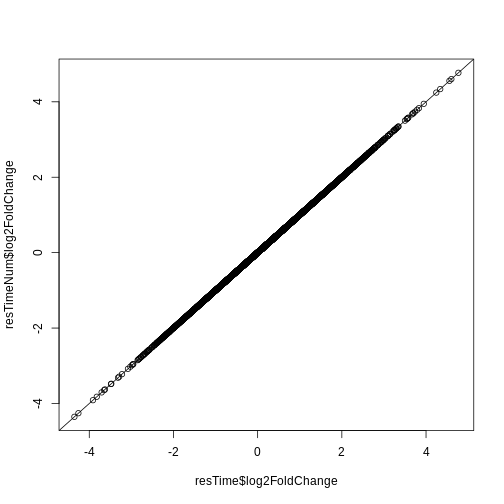

``` r
## -log10(p-value)
plot(-log10(resTime$pvalue), -log10(resTimeNum$pvalue))
abline(0, 1)
```

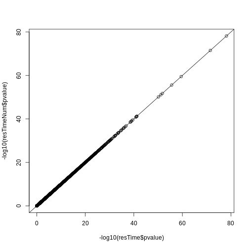

## Redo DESeq2 analysis with interaction

Next, let's look at a different setup. 
We still consider the sex and time predictors, but now we allow an interaction between them. 
In other words, we allow the time effect to be different for males and females. 


``` r
se <- readRDS("data/GSE96870_se.rds")
se <- se[rowSums(assay(se, "counts")) > 5, ]
dds <- DESeq2::DESeqDataSet(se, design = ~ sex * time)
dds <- DESeq(dds)
```

``` output
estimating size factors
```

``` output
estimating dispersions
```

``` output
gene-wise dispersion estimates
```

``` output
mean-dispersion relationship
```

``` output
final dispersion estimates
```

``` output
fitting model and testing
```

``` r
attr(dds, "modelMatrix")
```

``` output
               Intercept sex_Male_vs_Female time_Day4_vs_Day0 time_Day8_vs_Day0
Female_Day0_9          1                  0                 0                 0
Female_Day0_10         1                  0                 0                 0
Female_Day0_8          1                  0                 0                 0
Female_Day0_4          1                  0                 0                 0
Male_Day0_11           1                  1                 0                 0
Male_Day0_7            1                  1                 0                 0
Male_Day0_2            1                  1                 0                 0
Female_Day4_15         1                  0                 1                 0
Female_Day4_22         1                  0                 1                 0
Female_Day4_21         1                  0                 1                 0
Female_Day4_20         1                  0                 1                 0
Male_Day4_18           1                  1                 1                 0
Male_Day4_13           1                  1                 1                 0
Male_Day4_1            1                  1                 1                 0
Male_Day4_12           1                  1                 1                 0
Female_Day8_14         1                  0                 0                 1
Female_Day8_5          1                  0                 0                 1
Female_Day8_16         1                  0                 0                 1
Female_Day8_19         1                  0                 0                 1
Male_Day8_6            1                  1                 0                 1
Male_Day8_23           1                  1                 0                 1
Male_Day8_24           1                  1                 0                 1
               sexMale.timeDay4 sexMale.timeDay8
Female_Day0_9                 0                0
Female_Day0_10                0                0
Female_Day0_8                 0                0
Female_Day0_4                 0                0
Male_Day0_11                  0                0
Male_Day0_7                   0                0
Male_Day0_2                   0                0
Female_Day4_15                0                0
Female_Day4_22                0                0
Female_Day4_21                0                0
Female_Day4_20                0                0
Male_Day4_18                  1                0
Male_Day4_13                  1                0
Male_Day4_1                   1                0
Male_Day4_12                  1                0
Female_Day8_14                0                0
Female_Day8_5                 0                0
Female_Day8_16                0                0
Female_Day8_19                0                0
Male_Day8_6                   0                1
Male_Day8_23                  0                1
Male_Day8_24                  0                1
attr(,"assign")
[1] 0 1 2 2 3 3
attr(,"contrasts")
attr(,"contrasts")$sex
[1] "contr.treatment"

attr(,"contrasts")$time
[1] "contr.treatment"
```

Let's visualize this design: 


``` r
vd <- VisualizeDesign(sampleData = colData(dds)[, c("sex", "time")], 
                      designMatrix = attr(dds, "modelMatrix"), 
                      flipCoordFitted = TRUE)
vd$plotlist
```

``` output
[[1]]
```

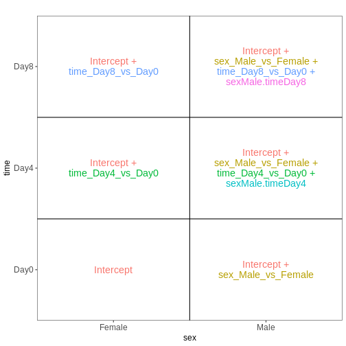

Note that now, the `time_Day8_vs_Day0` coefficient represents the difference between Day8 and Day0 **for the Female samples**. 
To get the corresponding difference for the male samples, we need to also add the interaction effect (`sexMale.timeDay8`). 


``` r
## Day8 vs Day0, female
resTimeFemale <- results(dds, contrast = c("time", "Day8", "Day0"))

## Interaction effect (difference in Day8-Day0 effect between Male and Female)
resTimeInt <- results(dds, name = "sexMale.timeDay8")
```

Let's try to fit this model with the second approach mentioned above, namely to create a single factor.


``` r
se <- readRDS("data/GSE96870_se.rds")
se <- se[rowSums(assay(se, "counts")) > 5, ]
se$sex_time <- paste0(se$sex, "_", se$time)
dds <- DESeq2::DESeqDataSet(se, design = ~ 0 + sex_time)
dds <- DESeq(dds)
```

``` output
estimating size factors
```

``` output
estimating dispersions
```

``` output
gene-wise dispersion estimates
```

``` output
mean-dispersion relationship
```

``` output
final dispersion estimates
```

``` output
fitting model and testing
```

``` r
attr(dds, "modelMatrix")
```

``` output
               sex_timeFemale_Day0 sex_timeFemale_Day4 sex_timeFemale_Day8
Female_Day0_9                    1                   0                   0
Female_Day0_10                   1                   0                   0
Female_Day0_8                    1                   0                   0
Female_Day0_4                    1                   0                   0
Male_Day0_11                     0                   0                   0
Male_Day0_7                      0                   0                   0
Male_Day0_2                      0                   0                   0
Female_Day4_15                   0                   1                   0
Female_Day4_22                   0                   1                   0
Female_Day4_21                   0                   1                   0
Female_Day4_20                   0                   1                   0
Male_Day4_18                     0                   0                   0
Male_Day4_13                     0                   0                   0
Male_Day4_1                      0                   0                   0
Male_Day4_12                     0                   0                   0
Female_Day8_14                   0                   0                   1
Female_Day8_5                    0                   0                   1
Female_Day8_16                   0                   0                   1
Female_Day8_19                   0                   0                   1
Male_Day8_6                      0                   0                   0
Male_Day8_23                     0                   0                   0
Male_Day8_24                     0                   0                   0
               sex_timeMale_Day0 sex_timeMale_Day4 sex_timeMale_Day8
Female_Day0_9                  0                 0                 0
Female_Day0_10                 0                 0                 0
Female_Day0_8                  0                 0                 0
Female_Day0_4                  0                 0                 0
Male_Day0_11                   1                 0                 0
Male_Day0_7                    1                 0                 0
Male_Day0_2                    1                 0                 0
Female_Day4_15                 0                 0                 0
Female_Day4_22                 0                 0                 0
Female_Day4_21                 0                 0                 0
Female_Day4_20                 0                 0                 0
Male_Day4_18                   0                 1                 0
Male_Day4_13                   0                 1                 0
Male_Day4_1                    0                 1                 0
Male_Day4_12                   0                 1                 0
Female_Day8_14                 0                 0                 0
Female_Day8_5                  0                 0                 0
Female_Day8_16                 0                 0                 0
Female_Day8_19                 0                 0                 0
Male_Day8_6                    0                 0                 1
Male_Day8_23                   0                 0                 1
Male_Day8_24                   0                 0                 1
attr(,"assign")
[1] 1 1 1 1 1 1
attr(,"contrasts")
attr(,"contrasts")$sex_time
[1] "contr.treatment"
```

We again visualize this design: 


``` r
vd <- VisualizeDesign(sampleData = colData(dds)[, c("sex", "time")], 
                      designMatrix = attr(dds, "modelMatrix"), 
                      flipCoordFitted = TRUE)
vd$plotlist
```

``` output
[[1]]
```

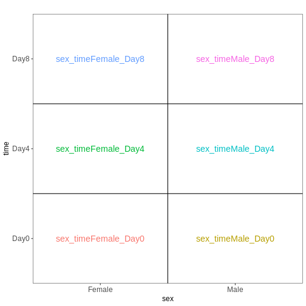

We then set up the same contrasts as above


``` r
## Day8 vs Day0, female
resTimeFemaleSingle <- results(dds, contrast = c("sex_time", "Female_Day8", "Female_Day0"))

## Interaction effect (difference in Day8-Day0 effect between Male and Female)
resultsNames(dds)
```

``` output
[1] "sex_timeFemale_Day0" "sex_timeFemale_Day4" "sex_timeFemale_Day8"
[4] "sex_timeMale_Day0"   "sex_timeMale_Day4"   "sex_timeMale_Day8"  
```

``` r
resTimeIntSingle <- results(dds, contrast = c(1, 0, -1, -1, 0, 1))
```

Check that these results agree with the ones obtained by fitting the model with the two factors and the interaction term. 


``` r
summary(resTimeFemale)
```

``` output

out of 27430 with nonzero total read count
adjusted p-value < 0.1
LFC > 0 (up)       : 2969, 11%
LFC < 0 (down)     : 3218, 12%
outliers [1]       : 6, 0.022%
low counts [2]     : 6382, 23%
(mean count < 3)
[1] see 'cooksCutoff' argument of ?results
[2] see 'independentFiltering' argument of ?results
```

``` r
summary(resTimeFemaleSingle)
```

``` output

out of 27430 with nonzero total read count
adjusted p-value < 0.1
LFC > 0 (up)       : 2969, 11%
LFC < 0 (down)     : 3218, 12%
outliers [1]       : 6, 0.022%
low counts [2]     : 6382, 23%
(mean count < 3)
[1] see 'cooksCutoff' argument of ?results
[2] see 'independentFiltering' argument of ?results
```

``` r
plot(-log10(resTimeFemale$pvalue), -log10(resTimeFemaleSingle$pvalue))
abline(0, 1)
```

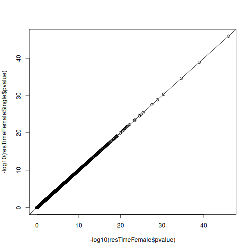

``` r
summary(resTimeInt)
```

``` output

out of 27430 with nonzero total read count
adjusted p-value < 0.1
LFC > 0 (up)       : 0, 0%
LFC < 0 (down)     : 0, 0%
outliers [1]       : 6, 0.022%
low counts [2]     : 0, 0%
(mean count < 0)
[1] see 'cooksCutoff' argument of ?results
[2] see 'independentFiltering' argument of ?results
```

``` r
summary(resTimeIntSingle)
```

``` output

out of 27430 with nonzero total read count
adjusted p-value < 0.1
LFC > 0 (up)       : 0, 0%
LFC < 0 (down)     : 0, 0%
outliers [1]       : 6, 0.022%
low counts [2]     : 0, 0%
(mean count < 0)
[1] see 'cooksCutoff' argument of ?results
[2] see 'independentFiltering' argument of ?results
```

``` r
plot(-log10(resTimeInt$pvalue), -log10(resTimeIntSingle$pvalue))
abline(0, 1)
```

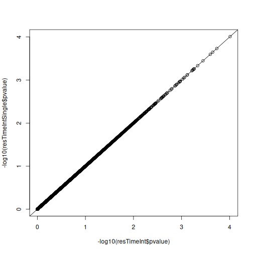


:::::::::::::::::::::::::::::::::::::::: keypoints

- The formula framework in R allows creation of design matrices, which details the variables expected to be associated with systematic differences in gene expression levels. 
- Comparisons of interest can be defined using contrasts, which are linear combinations of the model coefficients. 


::::::::::::::::::::::::::::::::::::::::::::::::::


