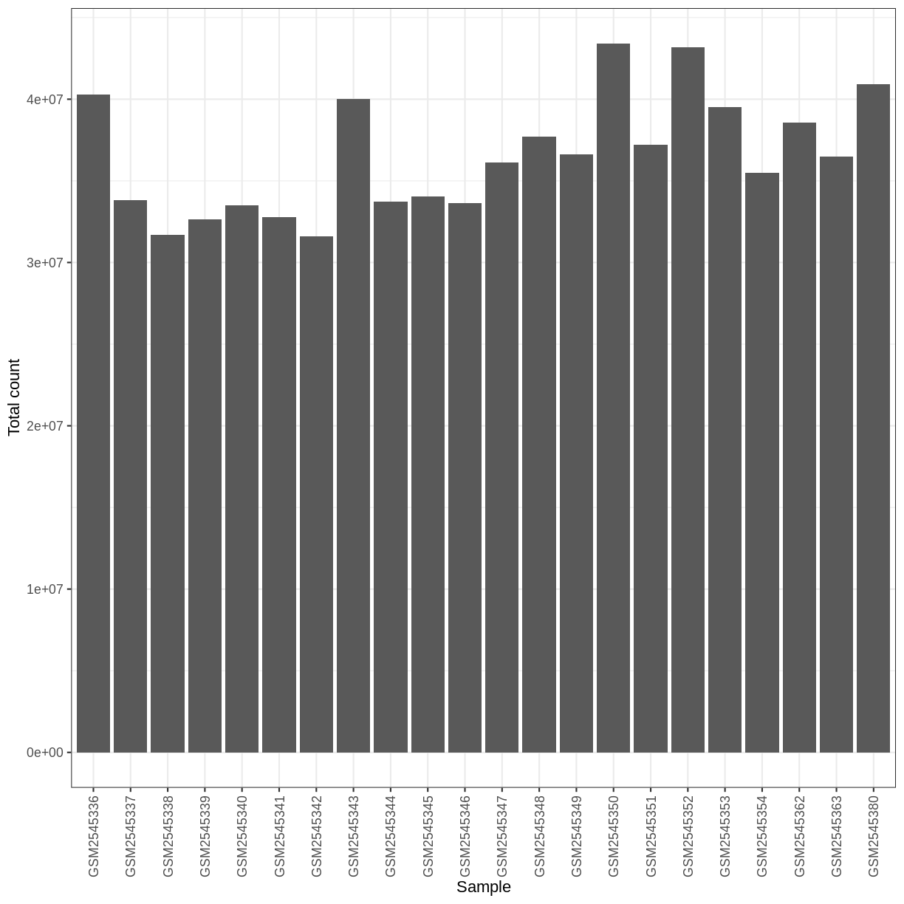
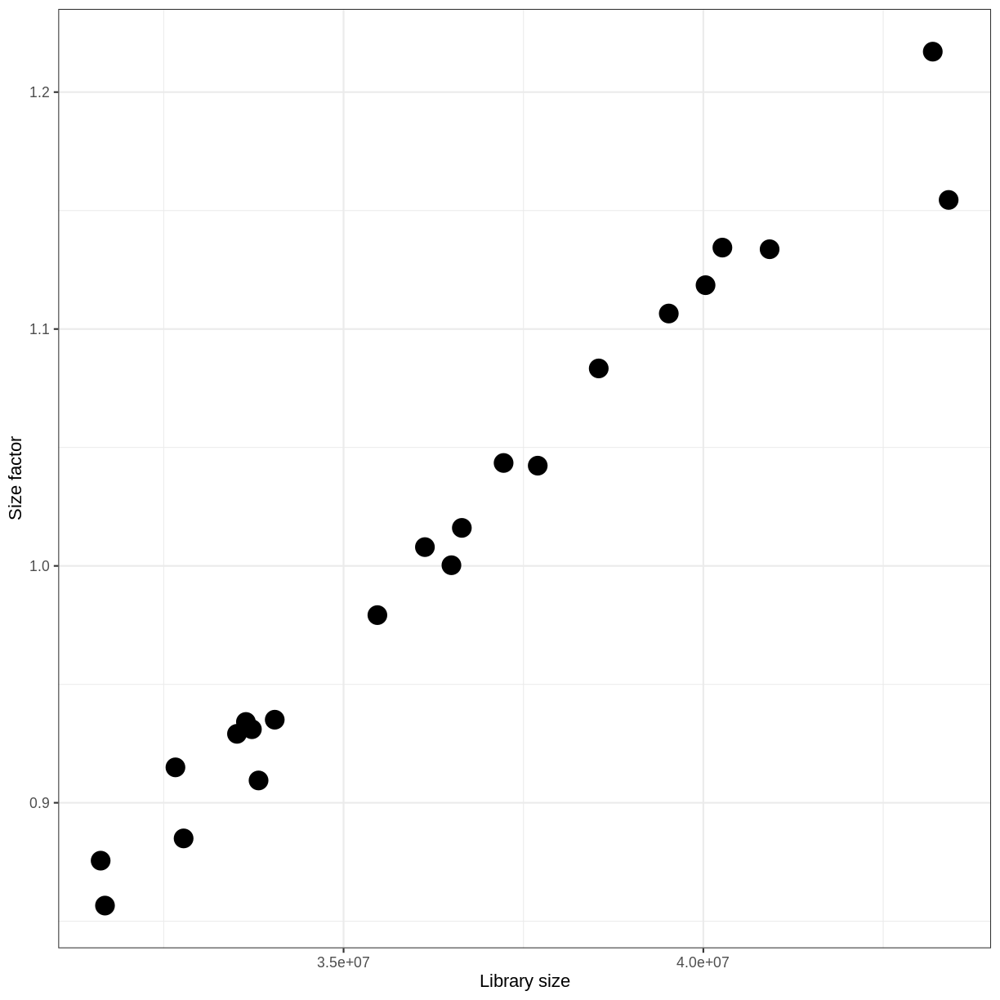
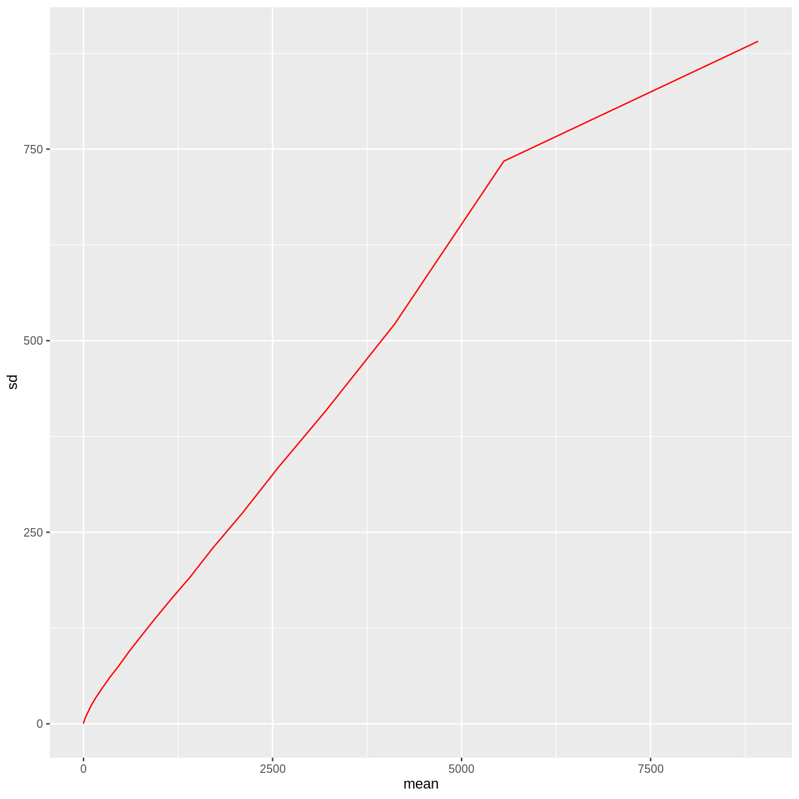
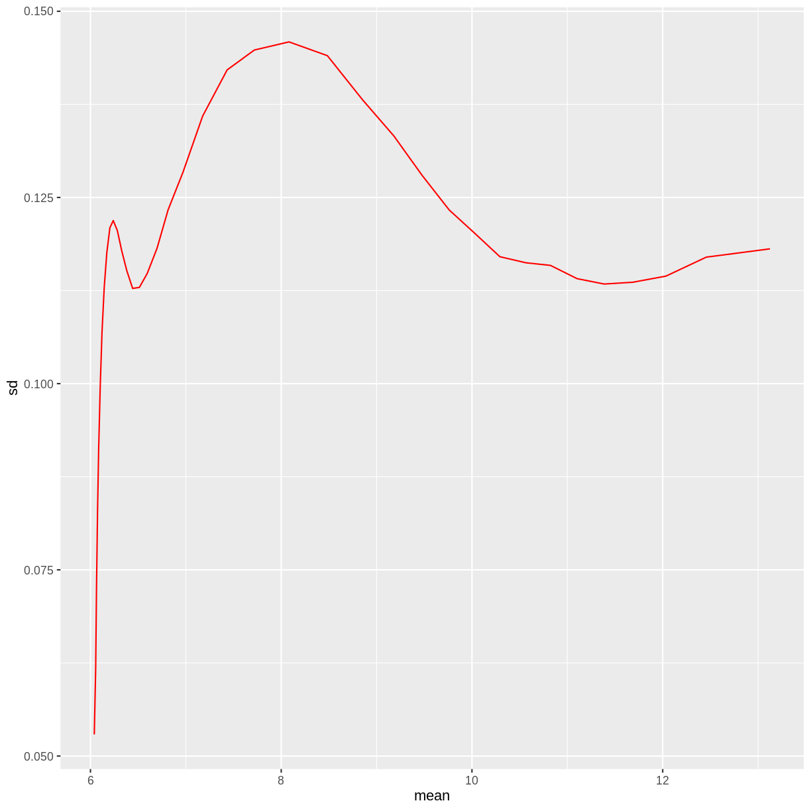
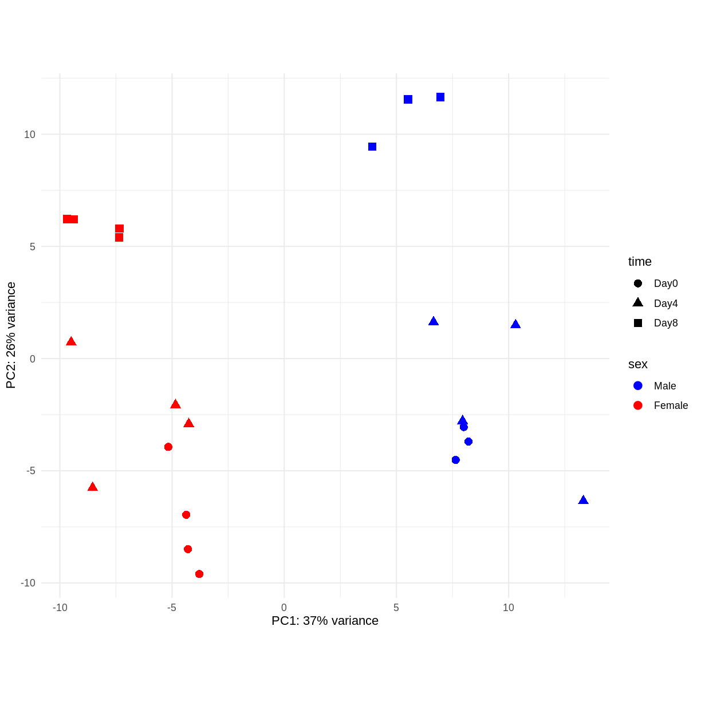

---
# Please do not edit this file directly; it is auto generated.
# Instead, please edit 05-exploratory-qc.md in _episodes_rmd/
source: Rmd
title: "Exploratory analysis and quality control"
teaching: XX
exercises: XX
questions:
- ""
objectives:
- "Learn how to explore the gene expression matrix and perform common quality control steps."
- "Learn how to set up an interactive application for exploratory analysis."
keypoints:
- "Key point 1"
editor_options: 
  chunk_output_type: console
---

> ## Contribute!
>
> This episode is intended to introduce various types of exploratory analysis 
> and QC steps taken before a formal statistical analysis is done.
{: .callout}

~~~
suppressPackageStartupMessages({
    library(SummarizedExperiment)
    library(DESeq2)
    library(vsn)
    library(ggplot2)
    library(ComplexHeatmap)
    library(RColorBrewer)
    library(hexbin)
})
~~~
{: .language-r}

~~~
se <- readRDS("data/GSE96870_se.rds")
~~~
{: .language-r}

Exploratory analysis is crucial for quality control and to get to know our data.
It can help us detect quality problems, sample swaps and contamination, as well as give us a sense of the most salient patterns present in the data. 
In this episode, we will learn about two common ways of performing exploratory analysis for RNA-seq data; namely clustering and principal component analysis (PCA). 
These tools are in no way limited to (or developed for) analysis of RNA-seq data.
However, there are certain characteristics of count assays that need to be taken into account when they are applied to this type of data. 

~~~
se <- se[rowSums(assay(se, "counts")) > 5, ]
dds <- DESeq2::DESeqDataSet(se[, se$tissue == "Cerebellum"],
                            design = ~ sex + time)
~~~
{: .language-r}

~~~
Warning in DESeq2::DESeqDataSet(se[, se$tissue == "Cerebellum"], design = ~sex
+ : some variables in design formula are characters, converting to factors
~~~
{: .warning}

# Library size differences

~~~
ggplot(data.frame(sample = colnames(dds), 
                  libSize = colSums(assay(dds, "counts"))),
       aes(x = sample, y = libSize)) + 
    geom_bar(stat = "identity") + theme_bw() + 
    labs(x = "Sample", y = "Total count") + 
    theme(axis.text.x = element_text(angle = 90, hjust = 1, vjust = 0.5))
~~~
{: .language-r}

Differences in the total number of reads assigned to genes between samples typically occur for technical reasons. 
In practice, it means that we can not simply compare the raw read count directly between samples and conclude that a sample with a higher read count also expresses the gene more strongly - the higher count may be caused by an overall higher number of reads in that sample. 
In the rest of this section, we will use the term _library size_ to refer to the total number of reads assigned to genes for a sample. 
We need to adjust for the differences in library size between samples, to avoid drawing incorrect conclusions. 
The way this is typically done for RNA-seq data can be described as a two-step procedure.
First, we estimate _size factors_ - sample-specific correction factors such that if the raw counts were to be divided by these factors, the resulting values would be more comparable across samples. 
Next, these size factors are incorporated into the statistical analysis of the data. 
It is important to pay close attention to how this is done in practice for a given analysis method.
Sometimes the division of the counts by the size factors needs to be done explicitly by the analyst.
Other times (as we will see for the differential expression analysis) it is important that they are provided separately to the analysis tool, which will then use them appropriately in the statistical model. 

With `DESeq2`, size factors are calculated using the `estimateSizeFactors()` function. 
The size factors estimated by this function combines an adjustment for differences in library sizes with an adjustment for differences in the RNA composition of the samples. 
The latter is important due to the compositional nature of RNA-seq data. 
There is a fixed number of reads to distribute between the genes, and if a single (or a few) very highly expressed gene consume a large part of the reads, all other genes will consequently receive very low counts. 

~~~
dds <- estimateSizeFactors(dds)
ggplot(data.frame(libSize = colSums(assay(dds, "counts")),
                  sizeFactor = sizeFactors(dds)),
       aes(x = libSize, y = sizeFactor)) + 
    geom_point(size = 5) + theme_bw() + 
    labs(x = "Library size", y = "Size factor")
~~~
{: .language-r}

# Transform data

There is a rich literature on methods for exploratory analysis. 
Most of these work best in situations where the variance of the input data (here, each gene) is relatively independent of the average value. 
For read count data such as RNA-seq, this is not the case.
In fact, the variance increases with the average read count. 

~~~
meanSdPlot(assay(dds), ranks = FALSE)
~~~
{: .language-r}

There are two ways around this: either we develop methods specifically adapted to count data, or we adapt (transform) the count data so that the existing methods are applicable. 
Both ways have been explored; however, at the moment the second approach is arguably more widely applied in practice. 

~~~
vsd <- DESeq2::vst(dds, blind = TRUE)
meanSdPlot(assay(vsd), ranks = FALSE)
~~~
{: .language-r}

# Heatmaps and clustering

~~~
dst <- dist(t(assay(vsd)))
colors <- colorRampPalette(brewer.pal(9, "Blues"))(255)
ComplexHeatmap::Heatmap(
    as.matrix(dst), 
    col = colors,
    name = "Euclidean\ndistance",
    cluster_rows = hclust(dst),
    cluster_columns = hclust(dst),
    bottom_annotation = columnAnnotation(
        sex = vsd$sex,
        time = vsd$time,
        col = list(sex = c(Female = "red", Male = "blue"),
                   time = c(Day0 = "yellow", Day4 = "forestgreen", Day8 = "purple")))
)
~~~
{: .language-r}

# PCA

Principal component analysis is a dimensionality reduction method, which projects the samples into a lower-dimensional space.
This lower-dimensional representation can be used for visualization, or as the input for other analysis methods.
The principal components are defined in such a way that they are orthogonal, and that the projection of the samples into the space they span contains as much variance as possible.
It is an _unsupervised_ method in the sense that no external information about the samples (e.g., the treatment condition) is taken into account. 
In the plot below we represent the samples in a two-dimensional principal component space. 
For each of the two dimensions, we indicate the fraction of the total variance that is represented by that component. 
By definition, the first principal component will always represent more of the variance than the subsequent ones. 
The fraction of explained variance is a measure of how much of the 'signal' in the data that is retained when we project the samples from the original, high-dimensional space to the low-dimensional space for visualization. 

~~~
pcaData <- DESeq2::plotPCA(vsd, intgroup = c("sex", "time"),
                           returnData = TRUE)
percentVar <- round(100 * attr(pcaData, "percentVar"))
ggplot(pcaData, aes(x = PC1, y = PC2)) +
    geom_point(aes(color = sex, shape = time), size = 5) +
    theme_minimal() +
    xlab(paste0("PC1: ", percentVar[1], "% variance")) +
    ylab(paste0("PC2: ", percentVar[2], "% variance")) +
    coord_fixed() + 
    scale_color_manual(values = c(Male = "blue", Female = "red"))
~~~
{: .language-r}

# Session info

~~~
sessionInfo()
~~~
{: .language-r}

~~~
R version 4.1.0 (2021-05-18)
Platform: x86_64-pc-linux-gnu (64-bit)
Running under: Ubuntu 20.04.2 LTS

Matrix products: default
BLAS:   /usr/lib/x86_64-linux-gnu/blas/libblas.so.3.9.0
LAPACK: /usr/lib/x86_64-linux-gnu/lapack/liblapack.so.3.9.0

locale:
 [1] LC_CTYPE=C.UTF-8       LC_NUMERIC=C           LC_TIME=C.UTF-8       
 [4] LC_COLLATE=C.UTF-8     LC_MONETARY=C.UTF-8    LC_MESSAGES=C.UTF-8   
 [7] LC_PAPER=C.UTF-8       LC_NAME=C              LC_ADDRESS=C          
[10] LC_TELEPHONE=C         LC_MEASUREMENT=C.UTF-8 LC_IDENTIFICATION=C   

attached base packages:
 [1] grid      parallel  stats4    stats     graphics  grDevices utils    
 [8] datasets  methods   base     

other attached packages:
 [1] hexbin_1.28.2               RColorBrewer_1.1-2         
 [3] ComplexHeatmap_2.8.0        ggplot2_3.3.5              
 [5] vsn_3.60.0                  DESeq2_1.32.0              
 [7] knitr_1.33                  SummarizedExperiment_1.22.0
 [9] Biobase_2.52.0              MatrixGenerics_1.4.0       
[11] matrixStats_0.60.0          GenomicRanges_1.44.0       
[13] GenomeInfoDb_1.28.1         IRanges_2.26.0             
[15] S4Vectors_0.30.0            BiocGenerics_0.38.0        

loaded via a namespace (and not attached):
 [1] httr_1.4.2             foreach_1.5.1          bit64_4.0.5           
 [4] splines_4.1.0          highr_0.9              BiocManager_1.30.16   
 [7] affy_1.70.0            blob_1.2.2             GenomeInfoDbData_1.2.6
[10] pillar_1.6.2           RSQLite_2.2.7          lattice_0.20-44       
[13] glue_1.4.2             limma_3.48.1           digest_0.6.27         
[16] XVector_0.32.0         colorspace_2.0-2       preprocessCore_1.54.0 
[19] Matrix_1.3-3           XML_3.99-0.6           pkgconfig_2.0.3       
[22] GetoptLong_1.0.5       genefilter_1.74.0      zlibbioc_1.38.0       
[25] purrr_0.3.4            xtable_1.8-4           scales_1.1.1          
[28] affyio_1.62.0          BiocParallel_1.26.1    tibble_3.1.3          
[31] annotate_1.70.0        KEGGREST_1.32.0        farver_2.1.0          
[34] generics_0.1.0         ellipsis_0.3.2         cachem_1.0.5          
[37] withr_2.4.2            survival_3.2-11        magrittr_2.0.1        
[40] crayon_1.4.1           memoise_2.0.0          evaluate_0.14         
[43] fansi_0.5.0            doParallel_1.0.16      Cairo_1.5-12.2        
[46] tools_4.1.0            GlobalOptions_0.1.2    lifecycle_1.0.0       
[49] stringr_1.4.0          munsell_0.5.0          locfit_1.5-9.4        
[52] cluster_2.1.2          DelayedArray_0.18.0    AnnotationDbi_1.54.1  
[55] Biostrings_2.60.1      compiler_4.1.0         rlang_0.4.11          
[58] RCurl_1.98-1.3         iterators_1.0.13       circlize_0.4.13       
[61] rjson_0.2.20           labeling_0.4.2         bitops_1.0-7          
[64] codetools_0.2-18       gtable_0.3.0           DBI_1.1.1             
[67] R6_2.5.0               dplyr_1.0.7            fastmap_1.1.0         
[70] bit_4.0.4              utf8_1.2.2             clue_0.3-59           
[73] shape_1.4.6            stringi_1.7.3          Rcpp_1.0.7            
[76] vctrs_0.3.8            geneplotter_1.70.0     png_0.1-7             
[79] tidyselect_1.1.1       xfun_0.24             
~~~
{: .output}

