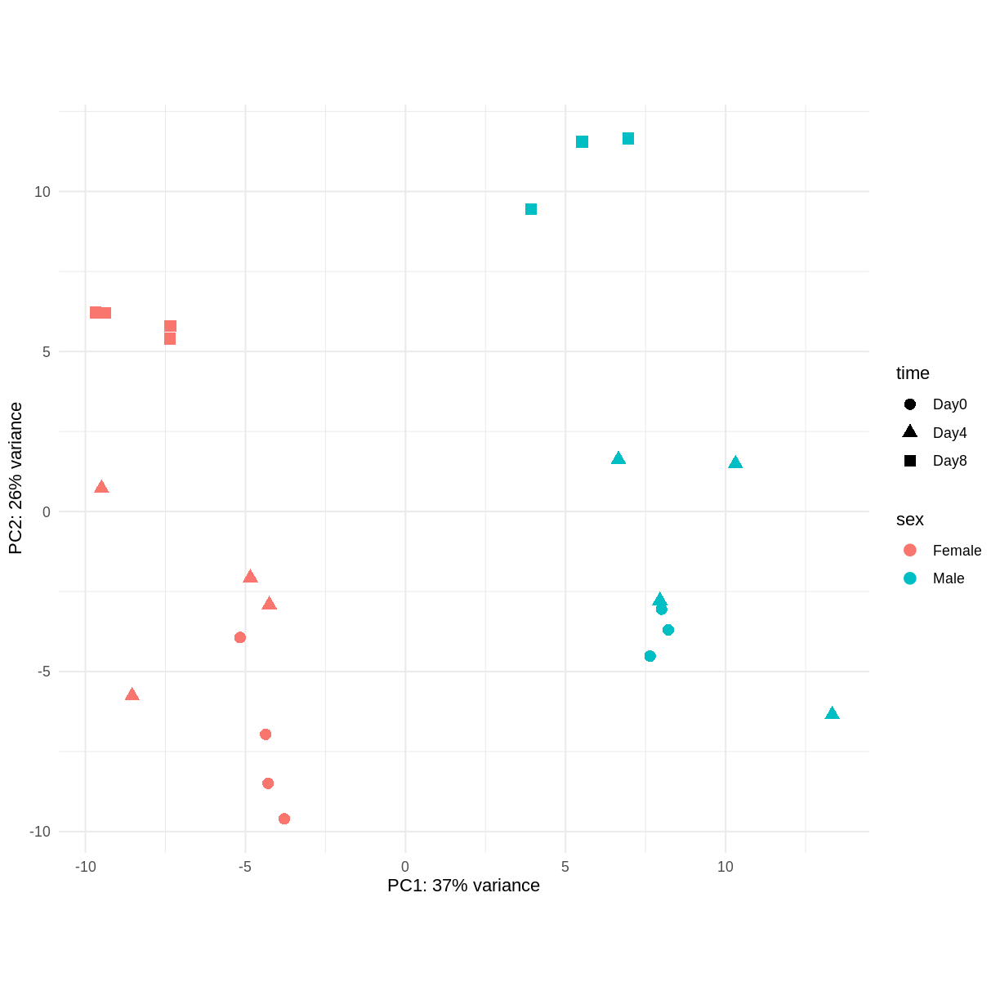
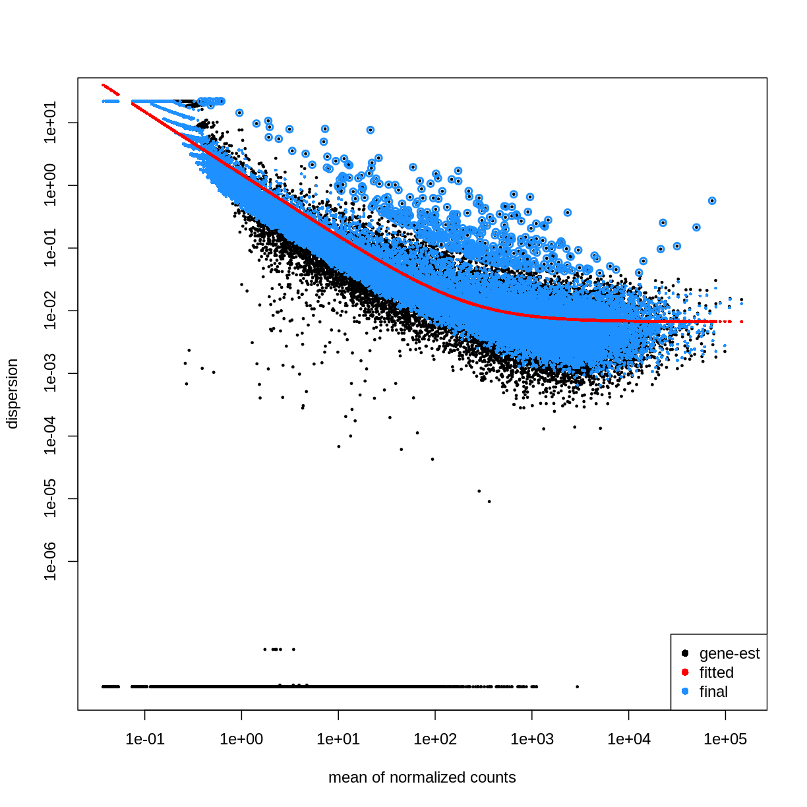
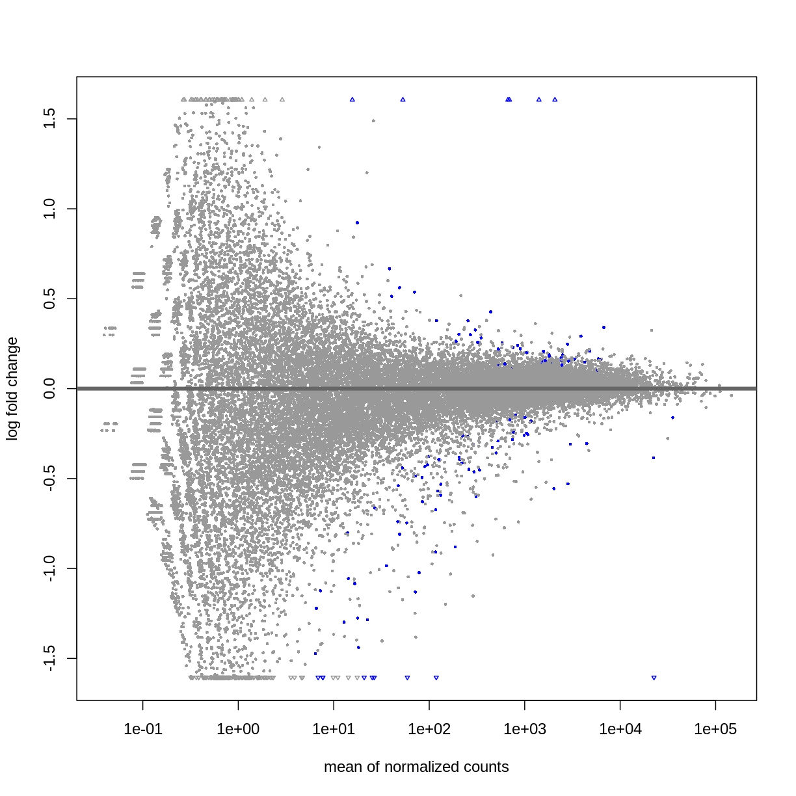
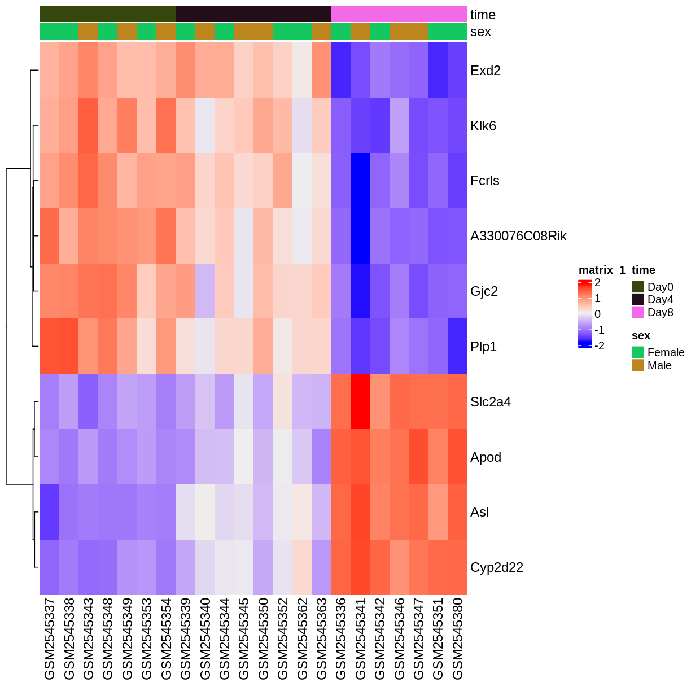

---
# Please do not edit this file directly; it is auto generated.
# Instead, please edit 06-differential-expression.md in _episodes_rmd/
source: Rmd
title: "Differential expression analysis"
teaching: XX
exercises: XX
questions:
- "How do we find differentially expressed genes?"
objectives:
- "Explain the steps involved in a differential expression analysis."
- "Explain how to perform these steps in R, using DESeq2."
keypoints:
- "Key point 1"
---

~~~
suppressPackageStartupMessages({
    library(SummarizedExperiment)
    library(DESeq2)
    library(ggplot2)
    library(ExploreModelMatrix)
    library(cowplot)
    library(ComplexHeatmap)
})
~~~
{: .language-r}

~~~
se <- readRDS(gzcon(url("https://github.com/Bioconductor/bioconductor-teaching/blob/master/data/GSE96870/GSE96870_se.rds?raw=true")))
se$sex <- factor(se$sex, levels = c("Female", "Male"))
se$infection <- factor(gsub(" ", "", gsub("-", "", se$infection)),
                       levels = c("NonInfected", "InfluenzaA"))
se$time <- factor(gsub(" ", "", se$time), levels = c("Day0", "Day4", "Day8"))
se$tissue <- factor(gsub(" ", "", se$tissue), levels = c("Cerebellum", "Spinalcord"))
se$mouse <- factor(as.numeric(se$mouse))
se
~~~
{: .language-r}

~~~
class: SummarizedExperiment 
dim: 41786 45 
metadata(0):
assays(1): counts
rownames(41786): Xkr4 LOC105243853 ... TrnT TrnP
rowData names(4): gene ENTREZID product gbkey
colnames(45): GSM2545336 GSM2545337 ... GSM2545379 GSM2545380
colData names(10): title geo_accession ... tissue mouse
~~~
{: .output}

~~~
dds <- DESeq2::DESeqDataSet(se[, se$tissue == "Cerebellum"],
                            design = ~ sex + time)
vsd <- DESeq2::vst(dds, blind = TRUE)
pcaData <- DESeq2::plotPCA(vsd, intgroup = c("sex", "time"),
                           returnData = TRUE)
percentVar <- round(100 * attr(pcaData, "percentVar"))
ggplot(pcaData, aes(x = PC1, y = PC2)) +
    geom_point(aes(color = sex, shape = time), size = 3) +
    theme_minimal() +
    xlab(paste0("PC1: ", percentVar[1], "% variance")) +
    ylab(paste0("PC2: ", percentVar[2], "% variance")) +
    coord_fixed()
~~~
{: .language-r}

~~~
dds <- DESeq2::DESeq(dds)
~~~
{: .language-r}

~~~
estimating size factors
~~~
{: .output}

~~~
estimating dispersions
~~~
{: .output}

~~~
gene-wise dispersion estimates
~~~
{: .output}

~~~
mean-dispersion relationship
~~~
{: .output}

~~~
final dispersion estimates
~~~
{: .output}

~~~
fitting model and testing
~~~
{: .output}

~~~
plotDispEsts(dds)
~~~
{: .language-r}

~~~
## Day 8 vs Day 0
resTime <- DESeq2::results(dds, contrast = c("time", "Day8", "Day0"))
summary(resTime)
~~~
{: .language-r}

~~~

out of 32652 with nonzero total read count
adjusted p-value < 0.1
LFC > 0 (up)       : 4472, 14%
LFC < 0 (down)     : 4276, 13%
outliers [1]       : 10, 0.031%
low counts [2]     : 8732, 27%
(mean count < 1)
[1] see 'cooksCutoff' argument of ?results
[2] see 'independentFiltering' argument of ?results
~~~
{: .output}

~~~
head(resTime[order(resTime$pvalue), ])
~~~
{: .language-r}

~~~
log2 fold change (MLE): time Day8 vs Day0 
Wald test p-value: time Day8 vs Day0 
DataFrame with 6 rows and 6 columns
               baseMean log2FoldChange     lfcSE      stat      pvalue        padj
              <numeric>      <numeric> <numeric> <numeric>   <numeric>   <numeric>
Asl             701.343        1.11733 0.0592541   18.8565 2.59885e-79 6.21386e-75
Apod          18765.146        1.44698 0.0805186   17.9708 3.30147e-72 3.94690e-68
Cyp2d22        2550.480        0.91020 0.0554756   16.4072 1.69794e-60 1.35326e-56
Klk6            546.503       -1.67190 0.1058989  -15.7877 3.78228e-56 2.26086e-52
Fcrls           184.235       -1.94701 0.1279847  -15.2128 2.90708e-52 1.39017e-48
A330076C08Rik   107.250       -1.74995 0.1154279  -15.1606 6.45112e-52 2.57077e-48
~~~
{: .output}

~~~
DESeq2::plotMA(resTime)
~~~
{: .language-r}

~~~
## Male vs Female
resSex <- DESeq2::results(dds, contrast = c("sex", "Male", "Female"))
summary(resSex)
~~~
{: .language-r}

~~~

out of 32652 with nonzero total read count
adjusted p-value < 0.1
LFC > 0 (up)       : 53, 0.16%
LFC < 0 (down)     : 71, 0.22%
outliers [1]       : 10, 0.031%
low counts [2]     : 13717, 42%
(mean count < 6)
[1] see 'cooksCutoff' argument of ?results
[2] see 'independentFiltering' argument of ?results
~~~
{: .output}

~~~
head(resSex[order(resSex$pvalue), ])
~~~
{: .language-r}

~~~
log2 fold change (MLE): sex Male vs Female 
Wald test p-value: sex Male vs Female 
DataFrame with 6 rows and 6 columns
               baseMean log2FoldChange     lfcSE      stat       pvalue         padj
              <numeric>      <numeric> <numeric> <numeric>    <numeric>    <numeric>
Xist         22603.0359      -11.60429  0.336282  -34.5076 6.16852e-261 1.16739e-256
Ddx3y         2072.9436       11.87241  0.397493   29.8683 5.08722e-196 4.81378e-192
Eif2s3y       1410.8750       12.62514  0.565216   22.3369 1.62066e-110 1.02237e-106
Kdm5d          692.1672       12.55386  0.593627   21.1477  2.89566e-99  1.37001e-95
Uty            667.4375       12.01728  0.593591   20.2451  3.92780e-91  1.48667e-87
LOC105243748    52.9669        9.08325  0.597624   15.1989  3.59432e-52  1.13371e-48
~~~
{: .output}

~~~
DESeq2::plotMA(resSex)
~~~
{: .language-r}

~~~
genes <- rownames(head(resTime[order(resTime$pvalue), ], 10))
heatmapData <- assay(vsd)[genes, ]
heatmapData <- t(scale(t(heatmapData)))
heatmapColAnnot <- data.frame(colData(vsd)[, c("time", "sex")])
idx <- order(vsd$time)
heatmapData <- heatmapData[, idx]
heatmapColAnnot <- HeatmapAnnotation(df = heatmapColAnnot[idx, ])
ComplexHeatmap::Heatmap(heatmapData,
                        top_annotation = heatmapColAnnot,
                        cluster_rows = TRUE, cluster_columns = FALSE)
~~~
{: .language-r}

