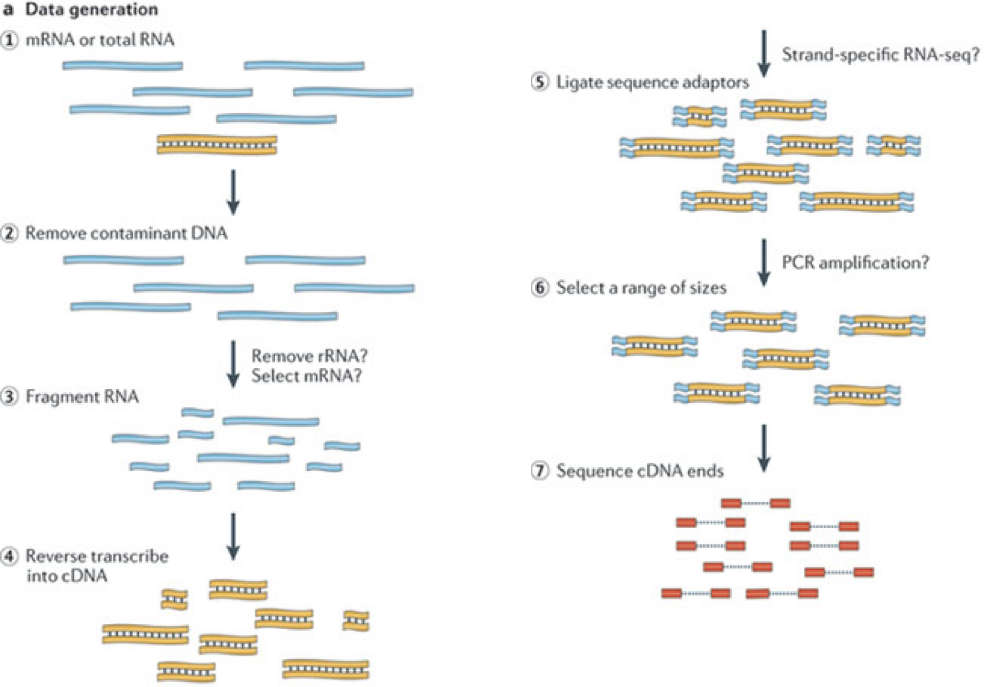

::::::::::::::::::::::::::::::::::::::: objectives

- Explain what RNA-seq is.
- Describe some of the most common design choices that have to be made before running an RNA-seq experiment.
- Provide an overview of the procedure to go from the raw data to the read count matrix that will be used for downstream analysis.
- Show some common types of results and visualizations generated in RNA-seq analyses.

::::::::::::::::::::::::::::::::::::::::::::::::::

:::::::::::::::::::::::::::::::::::::::: questions

- What are the different choices to consider when planning an RNA-seq experiment? 
- How does one process the raw fastq files to generate a table with read counts per gene and sample?
- Where does one find information about annotated genes for a given organism?
- What are the typical steps in an RNA-seq analysis?

::::::::::::::::::::::::::::::::::::::::::::::::::

# What are we measuring in an RNA-seq experiment? 

In order to produce an RNA molecule, a stretch of DNA is first transcribed into mRNA. 
Subsequently, intronic regions are spliced out, and exonic regions are combined into different _isoforms_ of a gene. 

(figure adapted from [Martin & Wang (2011)](https://www.nature.com/articles/nrg3068)).

In a typical RNA-seq experiment, RNA molecules are first collected from a sample of interest.
After a potential enrichment for molecules with polyA tails (predominantly mRNA), or depletion of otherwise highly abundant ribosomal RNA, the remaining molecules are fragmented into smaller pieces (there are also long-read protocols where entire molecules are considered, but those are not the focus of this lesson).
It is important to keep in mind that because of the splicing excluding intronic sequences, an RNA molecule (and hence a generated fragment) may not correspond to an uninterrupted region of the genome. 
The RNA fragments are then reverse transcribed into cDNA, whereafter sequencing adapters are added to each end. 
These adapters allow the fragments to attach to the flow cell. 
Once attached, each fragment will be heavily amplified to generate a cluster of identical sequences on the flow cell.
The sequencer then determines the sequence of the first 50-200 nucleotides of the cDNA fragments in each such cluster, starting from one end, which corresponds to a _read_. 
Many data sets are generated with so called paired-end protocols, in which the fragments are read from both ends. 
Millions of such reads (or pairs of reads) will be generated in an experiment, and these will be represented in a (pair of) FASTQ files. 
Each read is represented by four consecutive lines in such a file: first a line with a unique read identifier, next the inferred sequence of the read, then another identifier line, and finally a line containing the base quality for each inferred nucleotide, representing the probability that the nucleotide in the corresponding position has been correctly identified. 

:::::::::::::::::::::::::::::::::::::::  challenge

## Challenge: Discuss the following points with your neighbor

1. What are potential advantages and disadvantages of paired-end protocols compared to only sequencing one end of a fragment?
2. What quality assessment can you think of that would be useful to perform on the FASTQ files with read sequences? 

::::::::::::::::::::::::::::::::::::::::::::::::::

# Experimental design considerations

Before starting to collect data, it is essential to take some time to think about the design of the experiment. 
Experimental design concerns the organization of experiments with the purpose of making sure that the right type of data, and enough of it, is available to answer the questions of interest as efficiently as possible. 
Aspects such as which conditions or sample groups to consider, how many replicates to collect, and how to plan the data collection in practice are important questions to consider. 
Many high-throughput biological experiments (including RNA-seq) are sensitive to ambient conditions, and it is often difficult to directly compare measurements that have been done on different days, by different analysts, in different centers, or using different batches of reagents. 
For this reason, it is very important to design experiments properly, to make it possible to disentangle different types of (primary and secondary) effects.

(figure from [Lazic (2017)](https://www.amazon.com/Experimental-Design-Laboratory-Biologists-Reproducibility/dp/1107424887)).

:::::::::::::::::::::::::::::::::::::::  challenge

## Challenge: Discuss with your neighbor

1. Why is it essential to have replicates? 

::::::::::::::::::::::::::::::::::::::::::::::::::

Importantly, not all replicates are equally useful, from a statistical point of view. 
One common way to classify the different types of replicates is as 'biological' and 'technical', where the latter are typically used to test the reproducibility of the measurement device, while biological replicates inform about the variability between different samples from a population of interest.
Another scheme classifies replicates (or units) into 'biological', 'experimental' and 'observational'. 
Here, biological units are entities we want to make inferences about (e.g., animals, persons).
Replication of biological units is required to make a general statement of the effect of a treatment - we can not draw a conclusion about the effect of drug on a population of mice by studying a single mouse only.
Experimental units are the smallest entities that can be _independently assigned to a treatment_ (e.g., animal, litter, cage, well). 
Only replication of experimental units constitute true replication.
Observational units, finally, are entities at which measurements are made.

To explore the impact of experimental design on the ability to answer questions of interest, we are going to use an interactive application, provided in the [ConfoundingExplorer](https://csoneson.github.io/ConfoundingExplorer/) package. 

:::::::::::::::::::::::::::::::::::::::  challenge

## Challenge

Launch the ConfoundingExplorer application and familiarize yourself with the interface.

::::::::::::::::::::::::::::::::::::::::::::::::::

:::::::::::::::::::::::::::::::::::::::  challenge

## Challenge

1. For a balanced design (equal distribution of replicates between the two groups in each batch), what is the effect of increasing the strength of the batch effect? Does it matter whether one adjusts for the batch effect or not?
2. For an increasingly unbalanced design (most or all replicates of one group coming from one batch), what is the effect of increasing the strength of the batch effect? Does it matter whether one adjusts for the batch effect or not?

::::::::::::::::::::::::::::::::::::::::::::::::::

# RNA-seq quantification: from reads to count matrix

The read sequences contained in the FASTQ files from the sequencer are typically not directly useful as they are, since we do not have the information about which gene or transcript they originate from. 
Thus, the first processing step is to attempt to identify the location of origin for each read, and use this to obtain an estimate of the number of reads originating from a gene (or another features, such as an individual transcript).
This can then be used as a proxy for the abundance, or expression level, of the gene.
There is a plethora of RNA quantification pipelines, and the most common approaches can be categorized into three main types:

1. Align reads to the genome, and count the number of reads that map within the exons of each gene.
   This is the one of simplest methods. For species for which the transcriptome is poorly annotated, this would be the preferred approach.
   Example: `STAR` alignment to GRCm39 + `Rsubread` [featureCounts](https://doi.org/10.1093%2Fnar%2Fgkz114)

2. Align reads to the transcriptome, quantify transcript expression, and summarize transcript expression into gene expression.
   This approach can produce accurate quantification results ([independent benchmarking](https://doi.org/10.1186/s13059-016-0940-1)), 
   particularly for high-quality samples without DNA contamination.
   Example: RSEM quantification using `rsem-calculate-expression --star` on the GENCODE GRCh38 transcriptome + `tximport`

3. Pseudoalign reads against the transcriptome, using the corresponding genome as a decoy, quantifying transcript expression in the process, 
   and summarize the transcript-level expression into gene-level expression.
   The advantages of this approach include: computational efficiency, mitigation of the effect of DNA contamination, and GC bias correction.
   Example: `salmon quant --gcBias` + `tximport`
   
At typical sequencing read depth, gene expression quantification is often more accurate than transcript expression quantification.
However, differential gene expression analyses can be [improved](https://doi.org/10.12688/f1000research.7563.1)
by having access also to transcript-level quantifications.

Other tools used in RNA-seq quantification include: TopHat2, bowtie2, kallisto, HTseq, among many others.

The choice of an appropriate RNA-seq quantification depends on the quality of the transcriptome annotation,
the quality of the RNA-seq library preparation, the presence of contaminating sequences, among many factors.
Often, it can be informative to compare the quantification results of multiple approaches. 

Because the best quantification method is species- and experiment-dependent, and often requires large amounts of computing resources, this workshop will not cover any specifics of how to generate the counts. 
Instead, we recommend checking out the references above and consulting with a local bioinformatics expert if you need help.

:::::::::::::::::::::::::::::::::::::::  challenge

## Challenge: Discuss the following points with your neighbor

1. Which of the mentioned RNA-Seq quantification tools have you heard about? Do you know other pros and cons of the methods?
2. Have you done your own RNA-Seq experiment? If so, what quantification tool did you use and why did you choose it?
3. Do you have access to specific tools / local bioinformatics expert / computational resources for quantification? If you don't, how might you gain access?
  
::::::::::::::::::::::::::::::::::::::::::::::::::

# Finding the reference sequences

In order to quantify abundances of known genes or transcripts from RNA-seq data, we need a reference database informing us of the sequence of these features, to which we can then compare our reads. 
This information can be obtained from different online repositories. 
It is highly recommended to choose one of these for a particular project, and not mix information from different sources. 
Depending on the quantification tool you have chosen, you will need different types of reference information. 
If you are aligning your reads to the genome and investigating the overlap with known annotated features, you will need the full genome sequence (provided in a fasta file) and a file that tells you the genomic location of each annotated feature (typically provided in a gtf file). 
If you are mapping your reads to the transcriptome, you will instead need a file with the sequence of each transcript (again, a fasta file). 

* If you are working with mouse or human samples, the [GENCODE project](https://www.gencodegenes.org/) provides well-curated reference files. 
* [Ensembl](https://www.ensembl.org/info/data/ftp/index.html) provides reference files for a large set of organisms, including [plants](https://plants.ensembl.org/info/data/ftp/index.html) and [fungi](https://fungi.ensembl.org/info/data/ftp/index.html).
* [UCSC](https://hgdownload.soe.ucsc.edu/downloads.html) also provides reference files for many organisms.

:::::::::::::::::::::::::::::::::::::::  challenge

## Challenge

Download the latest mouse transcriptome fasta file from GENCODE. What do the entries look like? Tip: to read the file into R, consider the `readDNAStringSet()` function from the `Biostrings` package.
  
::::::::::::::::::::::::::::::::::::::::::::::::::

# Where are we heading towards in this workshop? 

During the coming two days, we will discuss and practice how to perform differential expression analysis with Bioconductor, and how to interpret the results. 
We will start from a count matrix, and thus assume that the initial quality assessment and quantification of gene expression have already been done. 
The outcome of a differential expression analysis is often represented using graphical representations, such as MA plots and heatmaps (see below for examples). 

In the following episodes we will learn, among other things, how to generate and interpret these plots. 
It is also common to perform follow-up analyses to investigate whether there is a functional relationship among the top-ranked genes, so called gene set (enrichment) analysis, which will also be covered in a later episode. 

:::::::::::::::::::::::::::::::::::::::: keypoints

- RNA-seq is a technique of measuring the amount of RNA expressed within a cell/tissue and state at a given time.
- Many choices have to be made when planning an RNA-seq experiment, such as whether to perform poly-A selection or ribosomal depletion, whether to apply a stranded or an unstranded protocol, and whether to sequence the reads in a single-end or paired-end fashion. Each of the choices have consequences for the processing and interpretation of the data. 
- Many approaches exist for quantification of RNA-seq data. Some methods align reads to the genome and count the number of reads overlapping gene loci. Other methods map reads to the transcriptome and use a probabilistic approach to estimate the abundance of each gene or transcript. 
- Information about annotated genes can be accessed via several sources, including Ensembl, UCSC and GENCODE. 

::::::::::::::::::::::::::::::::::::::::::::::::::

