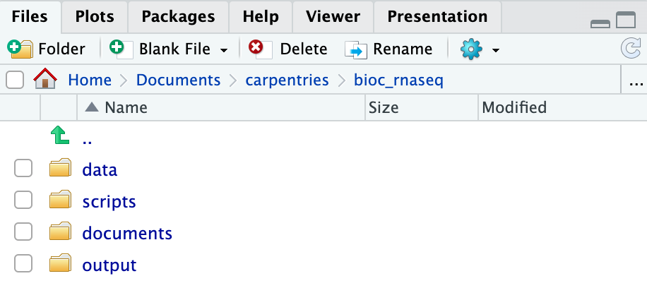
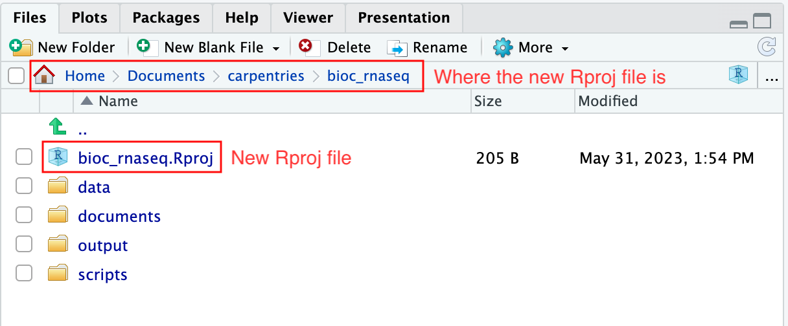

:::::::::::::::::::::::::::::::::::::: questions 

- How do you use RStudio project to manage your analysis project?
- What is the most effective way to organize directories for an analysis project?
- How to download a dataset from the internet and save it as a file.

::::::::::::::::::::::::::::::::::::::::::::::::

::::::::::::::::::::::::::::::::::::: objectives

- Create an RStudio project and the directories required for storing the files pertinent to an analysis project.
- Download the data set that will be used for the subsequent episodes.

::::::::::::::::::::::::::::::::::::::::::::::::

## Introduction

Typically, an analysis project begins with dataset files, a handful of R scripts and 
output files in a directory. 
As the project advances, complexity inevitably rises with the addition of more scripts, 
output files, and possibly new datasets. 
The complexity is further amplified when dealing with multiple versions of scripts and output files, 
necessitating efficient organisation.
If these are not well-managed from the beginning, resuming the project after a 
break, or sharing the project with someone else becomes challenging and time-consuming, 
as we struggle to recall the project's status and navigate the directory tree.
Additionally, without proper organisation, the project's complexity could lead to frequent 
use of the `setwd` function to switch between different working directories, 
resulting in a disorganised workspace.

In this lesson, we will first focus on an effective strategy for managing the files, 
both used and generated by our data analysis project, within a *working directory*.

:::::::::::::::::::::::::::::::::::::::  prereq

## What is a working directory?

A working directory in R is the default location on your computer where R looks 
for files to load or store any data you wish to save.
More information can be found in our 
[Introduction to data analysis with R and Bioconductor](https://carpentries-incubator.github.io/bioc-intro/20-r-rstudio.html#the-working-directory)
lesson.

:::::::::::::::::::::::::::::::::::::::

Secondly, we will also learn how to leverage RStudio projects, a feature built-in 
to RStudio for managing our analysis project.

:::::::::::::::::::::::::::::::::::::::  prereq

## What is RStudio?

RStudio is a freely available integrated development environment (IDE), widely used by scientists 
and software developers for developing software or analysing datasets in R.
If you require assistance with RStudio or its general usage, please refer to our
[Introduction to data analysis with R and Bioconductor](https://carpentries-incubator.github.io/bioc-intro/20-r-rstudio.html)
lesson.

:::::::::::::::::::::::::::::::::::::::

Finally, in this lesson, we will also learn to use the R function `download.file` 
to download the data for the subsequent episodes.

## Structuring your working directory

For a more streamlined workflow, we suggest storing all files associated with 
an analysis in a specific directory, which will serve as your project's working directory. 
Initially, this working directory should contain four distinct directories:

* `data`: dedicated to storing raw data. 
This folder should ideally only house raw data and not be modified unless you 
receive a new dataset (even then, if you have the storage capacity, we suggest you retain 
the previous dataset as well in case you need it again in the future). 
For RNA-seq data analysis, this directory will typically contain `*.fastq` files 
and any related metadata files for the experiment.
* `scripts`: for storing the R scripts you've written and utilised for analysing the data.
* `documents`: for storing documents related to your analysis, 
such as a manuscript outline or meeting notes with your team.
* `output`: for storing intermediate or final results generated by the R scripts
in the `scripts` directory. 
Importantly, if you carry out data cleaning or pre-processing, the output should 
ideally be stored in this directory, as these no longer represent raw data.

As your project grows in complexity, you might find it necessary to create more 
directories or sub-directories. 
Nevertheless, the aforementioned four directories should serve as the foundation 
of your working directory.

:::::::::::::::::::::::::::::::::::::::  challenge

## Create the directories for subsequent episodes

Create a directory on your computer to serve as the working directory for the rest 
of this episode and lesson (the workshop example uses a directory called `bio_rnaseq`). 
Then, within this chosen directory, create the four fundamental directories previously discussed
(`data`, `scripts`, `documents`, and `output`).

::::::::::::::::::::::::::::::::::: solution

```{r, fig.cap="Your working directory should look like this", echo=FALSE, message=FALSE}

```

:::::::::::::::::::::::::::::::::::

:::::::::::::::::::::::::::::::::::::::

## Using RStudio project to manage your working directory

As previously highlighted, RStudio project is a feature built-into RStudio for managing your analysis project.
It does so by storing project-specific settings in an `.Rproj` file stored in your project's working directory. 
Loading these settings up into RStudio by either opening the `.Rproj` file directly or through 
RStudio's open project option (from the menu bar, select `File` > `Open Project...`) will 
automatically set your working directory in R to the location of the `.Rproj` file, 
essentially your project's working directory.

To create an RStudio project:

1. Start RStudio.
2. Navigate to the menu bar and select `File` > `New Project...`.
3. Choose `Existing Directory`.
4. Click `Browse...` button, and select the directory you have previously chosen
as the working directory for the analysis (i.e., the directory where the 4 essential
directories reside).
1. Click `Create Project` at the bottom right of the window.

Upon completion of the steps above, you will find a `.Rproj` file within your project's working directory.

```{r, fig.cap="A new .Rproj file should be created in your chosen working directory.", echo=FALSE, message=FALSE}

```

Moreover, the heading of your RStudio console should now also display the absolute path of 
your project's working directory, i.e., where the `.Rproj` file resides, indicating that RStudio has set 
this directory as your working directory in R.

```{r, fig.cap="Your R working directory should now be set to where the .Rproj file resides.", echo=FALSE, message=FALSE}
knitr::include_graphics("fig/02_setup/rstudio_console.png")
```

From this point forward, any R code that you execute that involves reading data from a file or saving
data in a file will, by default, be directed to a path relative to your project's working directory.

If you wish to close the project, perhaps to open another project, create a new one, or take a break
from the project, you can do so by using to `File` > `Close Project` option located in the menu bar. To open the project back up, either double-click on the .Rproj file in the working directory, or open up RStudio and using the `File` > `Open Project` option in the menu bar.

## Download the RNA-seq data for subsequent episodes

Finally, we will learn how to use R to download the RNA-seq data required for the 
subsequent episodes of the lesson. 
The dataset we will be using was generated to investigate the impact upper-respiratory infection 
have on changes in RNA transcription in the cerebellum and spinal cord of mice. 
This dataset was produced as part of the following study:

> Blackmore, Stephen, et al. "Influenza infection triggers disease in a genetic 
> model of experimental autoimmune encephalomyelitis." 
> Proceedings of the National Academy of Sciences 114.30 (2017): E6107-E6116.

The dataset is available at [Gene Expression Omnibus (GEO)](https://www.ncbi.nlm.nih.gov/geo/), 
under the accession number [GSE96870](https://www.ncbi.nlm.nih.gov/geo/query/acc.cgi?acc=GSE96870). 
Downloading data from GEO is not straightforward (and won't be covered in this lesson). 
Hence, we have made the data available on our GitHub repository for easier access.

To download the files, we will use the R function `download.file`, which necessitates at least 
two parameters: `url` and `destfile`.
The `url` parameter is used to specify the address on the internet to download the data from. 
The `destfile` parameter indicates where to save the downloaded file and what 
the downloaded file should be named.

Let's download one of the four data files needed for the remainder of this lesson. 
The data file is located at https://github.com/carpentries-incubator/bioc-rnaseq/raw/main/episodes/data/GSE96870_counts_cerebellum.csv. 
We shall save the downloaded file in the `data` folder of our working directory with the name `GSE96870_counts_cerebellum.csv`.

```{r download-data}
download.file(
    url = "https://github.com/carpentries-incubator/bioc-rnaseq/raw/main/episodes/data/GSE96870_counts_cerebellum.csv", 
    destfile = "data/GSE96870_counts_cerebellum.csv"
)
```


:::::::::::::::::::::::::::::::::::::::  challenge

## Check that the data file matches the raw data on GEO

This is a substantial challenge.  You don't need to do it!  But you needn't trust us, either. 
You can verify that the raw data deposited on GEO is directly comparable to the prepared CSV.
To look up raw data for samples (GSMxxxx) on GEO, we can use the [GEOquery](https://doi.org/10.1093/bioinformatics/btm254) package.
The `GEOquery::getGEOSuppFiles()` function then allows one to download or read the raw data files in question.
The tricky part of this is writing a function to extract the data of interest from the raw data files on GEO.
Once we have that function, we can check that the provided CSV file contains the same counts as the raw data.

```{r check-geo-data}

# Below, we read the summarized data file into a data.frame and inspect its dimensions (how many rows, how many columns).
counts_URL <- "https://github.com/carpentries-incubator/bioc-rnaseq/raw/main/episodes/data/GSE96870_counts_cerebellum.csv"
counts_cerebellum <- read.csv(url(counts_URL), row.names=1)
dim(counts_cerebellum)
# [1] 41786    22

# Each column in the data.frame represents one of 22 GSMs (GEO Samples). 
GSMs_cerebellum <- colnames(counts_cerebellum)

# GEOquery can look up the raw data locations for these GSMs.
# Unfortunately, the dependencies for it crash this build!
# We will illustrate the procedure and then use the results.
if (FALSE) { 
  if (!require("BiocManager")) install.packages("BiocManager")
  if (!require("GEOquery")) BiocManager::install("GEOquery")
  library(GEOquery)
  getSuppURL <- function(GSM) GEOquery::getGEOSuppFiles(GSM, fetch=FALSE)[1, "url"]
  GSM_URLs <- sapply(GSMs_cerebellum, getSuppURL)
} else {
  GSM_URLprefix <- "https://ftp.ncbi.nlm.nih.gov/geo/samples/GSM2545nnn"
  GSM_URLsep <- "suppl"
  GSM_files <- c("GSM2545336_10C_CTGAAGCT-GTACTGAC_L00M_featCounts.txt.gz",
                 "GSM2545337_11C_TAATGCGC-TATAGCCT_L00M_featCounts.txt.gz",
                 "GSM2545338_12C_TAATGCGC-ATAGAGGC_L00M_featCounts.txt.gz",
                 "GSM2545339_13C_TAATGCGC-CCTATCCT_L00M_featCounts.txt.gz",
                 "GSM2545340_14C_TAATGCGC-GGCTCTGA_L00M_featCounts.txt.gz",
                 "GSM2545341_17C_TAATGCGC-AGGCGAAG_L00M_featCounts.txt.gz",
                 "GSM2545342_1C_CTGAAGCT-TATAGCCT_L00M_featCounts.txt.gz",
                 "GSM2545343_20C_TAATGCGC-GTACTGAC_L00M_featCounts.txt.gz",
                 "GSM2545344_21C_CGGCTATG-TATAGCCT_L00M_featCounts.txt.gz",
                 "GSM2545345_22C_CGGCTATG-ATAGAGGC_L00M_featCounts.txt.gz",
                 "GSM2545346_25C_CGGCTATG-CCTATCCT_L00M_featCounts.txt.gz",
                 "GSM2545347_26C_CGGCTATG-GGCTCTGA_L00M_featCounts.txt.gz",
                 "GSM2545348_27C_CGGCTATG-AGGCGAAG_L00M_featCounts.txt.gz",
                 "GSM2545349_28C_CGGCTATG-TAATCTTA_L00M_featCounts.txt.gz",
                 "GSM2545350_29C_CGGCTATG-CAGGACGT_L00M_featCounts.txt.gz",
                 "GSM2545351_2C_CTGAAGCT-ATAGAGGC_L00M_featCounts.txt.gz",
                 "GSM2545352_30C_CGGCTATG-GTACTGAC_L00M_featCounts.txt.gz",
                 "GSM2545353_3C_CTGAAGCT-CCTATCCT_L00M_featCounts.txt.gz",
                 "GSM2545354_4C_CTGAAGCT-GGCTCTGA_L00M_featCounts.txt.gz",
                 "GSM2545362_5C_CTGAAGCT-AGGCGAAG_L00M_featCounts.txt.gz",
                 "GSM2545363_6C_CTGAAGCT-TAATCTTA_L00M_featCounts.txt.gz",
                 "GSM2545380_9C_CTGAAGCT-CAGGACGT_L00M_featCounts.txt.gz")
  GSM_URLs <- paste(GSM_URLprefix, GSMs_cerebellum, "suppl", GSM_files, sep="/")
  names(GSM_URLs) <- GSMs_cerebellum
}

# To extract the read counts per gene for each sample, we write a small function.
fetch_featcounts <- function(GSM_URL) {
  message("Processing ", GSM_URL)
  tsv <- readLines(gzcon(url(GSM_URL)))[-1][-1] # drop header and colnames 
  genes <- sapply(strsplit(tsv, "\t"), "[[", 1)
  featcounts <- as.integer(sapply(strsplit(tsv, "\t"), "[[", 7))
  names(featcounts) <- genes
  return(featcounts)
}

# We use lapply(), cbind(), and do.call() to add each column of read counts:
counts_GSMs <- data.frame(do.call(cbind, lapply(GSM_URLs, fetch_featcounts)))
dim(counts_GSMs)
# [1] 41786    22

```

Above we demonstrate that the numbers of genes and samples are the same. 
However, that does not demonstrate that the read counts are the same.
Is there a function in R that will check whether two objects are identical?

:::::::::::::::::::::::::::::::::::::  solution

The `identical()` function verifies that two objects in R are the same, save for their name.

```{r check-geo-data-solution}

# Don't bother checking the raw data if the dimensions don't match.
stopifnot(identical(dim(counts_cerebellum), dim(counts_GSMs)))

# If the dimensions do match, check if the data matches, too.
identical(counts_cerebellum, counts_GSMs)
# [1] TRUE
```

The prepared data file does indeed contain the same counts per gene as the raw GEO data files.

:::::::::::::::::::::::::::::::::::::


If you navigate to the `data` folder in your working directory, you should now find a file named
`GSE96870_counts_cerebellum.csv`.

```{r, fig.cap="A file named GSE96870_counts_cerebellum.csv should now reside in the data folder.", echo=FALSE, message=FALSE}
knitr::include_graphics("fig/02_setup/data_folder.png")
```

:::::::::::::::::::::::::::::::::::::::  challenge

## Download the remaining data set files

There are three more data set files we need to download for the remainder of this lesson.

| URL                                                                                                         | Filename                        |
| ----------------------------------------------------------------------------------------------------------- | ------------------------------- |
| https://github.com/carpentries-incubator/bioc-rnaseq/raw/main/episodes/data/GSE96870_coldata_cerebellum.csv | GSE96870_coldata_cerebellum.csv |
| https://github.com/carpentries-incubator/bioc-rnaseq/raw/main/episodes/data/GSE96870_coldata_all.csv        | GSE96870_coldata_all.csv        |
| https://github.com/carpentries-incubator/bioc-rnaseq/raw/main/episodes/data/GSE96870_rowranges.tsv          | GSE96870_rowranges.tsv          |

Use the `download.file` function to download the files into the `data` folder in your
working directory.

:::::::::::::::::::::::::::::::::::::  solution

```{r download-data-solution}
download.file(
    url = "https://github.com/carpentries-incubator/bioc-rnaseq/raw/main/episodes/data/GSE96870_coldata_cerebellum.csv", 
    destfile = "data/GSE96870_coldata_cerebellum.csv"
)

download.file(
    url = "https://github.com/carpentries-incubator/bioc-rnaseq/raw/main/episodes/data/GSE96870_coldata_all.csv", 
    destfile = "data/GSE96870_coldata_all.csv"
)

download.file(
    url = "https://github.com/carpentries-incubator/bioc-rnaseq/raw/main/episodes/data/GSE96870_rowranges.tsv", 
    destfile = "data/GSE96870_rowranges.tsv"
)
```

:::::::::::::::::::::::::::::::::::::


:::::::::::::::::::::::::::::::::::::::


::::::::::::::::::::::::::::::::::::: keypoints 

- Proper organisation of the files required for your project in a working directory is crucial for 
maintaining order and ensuring easy access in the future.
- RStudio project serves as a valuable tool for managing your project's working directory and 
facilitating analysis.
- The `download.file` function in R can be used for downloading datasets from the internet.

::::::::::::::::::::::::::::::::::::::::::::::::

